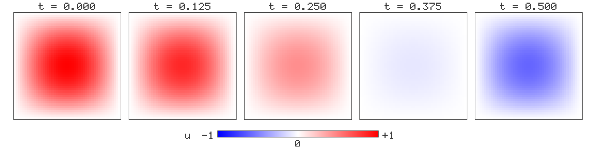

# A worked example: `Compile[]` and the 2-D wave equation

This is a tutorial on Mathilda's `Compile[]`, built around one problem that is
big enough to be worth compiling: an explicit finite-difference solver for the
wave equation on a square, marched in time.

It covers what the compiler can and cannot express, how to tell which of those
you are in, and what the speed actually is — measured against the same program
in the interpreter, against Wolfram Language 14.0 (`wolframscript`, both its
bytecode and its native-C compilation targets), and against `NDSolve`.

Every number below was measured on one machine (Apple M-series, macOS 15.6,
Mathilda at `-O3`) on 2026-07-27. The scripts are reproduced in full so they can
be re-run.

**Contents**

1. [The problem, and how we know the answer is right](#the-problem)
2. [The scheme](#the-scheme)
3. [Writing it: the interpreted version](#the-interpreted-version)
4. [Compiling it](#compiling-it)
5. [Is it actually compiled? `CompileDiagnostics`](#is-it-actually-compiled)
6. [Reading the bytecode: `CompilePrint`](#reading-the-bytecode)
7. [What `Compile[]` does to the numbers](#results)
8. [The solution, in pictures](#the-solution-in-pictures)
9. [Against Wolfram Language](#against-wolfram-language)
10. [Against `NDSolve`](#against-ndsolve)
11. [What is and is not in the compilable subset](#the-compilable-subset)
12. [Measurement traps found while writing this](#measurement-traps)

---

## The problem

Solve

$$u_{tt} = u_{xx} + u_{yy} \qquad \text{on } [0,1]^2,$$

with $u = 0$ on the boundary, $u(0,x,y) = \sin \pi x \, \sin \pi y$, and
$u_t(0,x,y) = 0$. The exact solution is a single standing mode,

$$u(t,x,y) = \sin \pi x \, \sin \pi y \, \cos\!\left(\sqrt 2\, \pi t\right).$$

We march to $T = 0.5$.

Having a closed-form solution matters for more than tidiness. A solver can be
wrong in two independent ways — the *discretisation* can be a poor approximation
of the PDE, and the *implementation* can be a poor realisation of the
discretisation — and a comparison against $u(t,x,y)$ alone cannot tell them
apart. So we check both, separately:

- **Physical error** — distance from the continuum solution. Should fall like
  $O(h^2)$. This validates the scheme.
- **Discrete error** — distance from the *exact solution of the difference
  equations*, derived in [The scheme](#the-scheme). Should be at roundoff, and stay there for hundreds
  of steps. This validates the implementation, and it is the one that catches
  an off-by-one in a stencil.

The second check is the reason this tutorial can make claims about correctness
at all. It is worth setting up whenever you write a scheme by hand.

---

## The scheme

Uniform grid $x_i = (i-1)h$, $y_j = (j-1)h$, $h = 1/(n-1)$; the standard
second-order explicit stencil,

$$u^{k+1}_{i,j} = 2u^k_{i,j} - u^{k-1}_{i,j} + \lambda^2\left(u^k_{i+1,j} + u^k_{i-1,j} + u^k_{i,j+1} + u^k_{i,j-1} - 4u^k_{i,j}\right),$$

with Courant number $\lambda = c\,\Delta t/h$. In 2-D this is stable for
$\lambda \le 1/\sqrt2$; we use $\lambda = 1/2$ throughout, so
$\Delta t = h/2$ and reaching $T = 0.5$ takes $n - 2$ steps from the two
starting levels.

**The exact discrete solution.** Write $\varphi_{ij} = \sin \pi x_i \sin \pi y_j$.
The discrete 5-point Laplacian has $\varphi$ as an eigenvector:

$$\varphi_{i+1,j} + \varphi_{i-1,j} + \varphi_{i,j+1} + \varphi_{i,j-1} - 4\varphi_{ij} = \left(4\cos \pi h - 4\right)\varphi_{ij}.$$

Substituting $u^k = \varphi \cos(k\theta)$ into the scheme and using
$\cos((k{+}1)\theta) + \cos((k{-}1)\theta) = 2\cos\theta\cos(k\theta)$ gives a
single condition,

$$\boxed{\;\cos\theta = 1 - 2\lambda^2\left(1 - \cos \pi h\right).\;}$$

So if we *start* the march from $u^0 = \varphi$ and $u^1 = \varphi\cos\theta$,
then $u^k = \varphi\cos(k\theta)$ holds **exactly**, for every $k$, in exact
arithmetic. Any deviation is floating-point roundoff or a bug. That is the
discrete reference.

```mathematica
h    = 1./(n - 1);
lam  = 0.5;
phi  = Table[Sin[Pi (i - 1) h] Sin[Pi (j - 1) h], {i, 1, n}, {j, 1, n}];
ct   = 1 - 2 lam^2 (1 - Cos[Pi h]);     (* = Cos[theta] *)
u0   = phi;
u1   = ct phi;
steps = n - 2;                          (* (steps+1) dt == 0.5 *)
```

---

## The interpreted version

One time step, written the way you would write it without a compiler in mind —
build the new grid with `Table`:

```mathematica
istep[up_, uc_, lam_, n_] :=
  Table[
    If[i == 1 || i == n || j == 1 || j == n, 0.,
      2 uc[[i, j]] - up[[i, j]] +
        lam^2 (uc[[i + 1, j]] + uc[[i - 1, j]] +
               uc[[i, j + 1]] + uc[[i, j - 1]] - 4 uc[[i, j]])],
    {i, 1, n}, {j, 1, n}];

up = u0; uc = u1;
Do[tmp = istep[up, uc, lam, n]; up = uc; uc = tmp, {steps}];
Max[Abs[Flatten[uc - Cos[(steps + 1) ArcCos[ct]] phi]]]
```

At `n = 41` this runs in **4.12 s** and reports a discrete error of
`2.78e-14` — the scheme is right.

It is also unusably slow. $41^2 \times 39 \approx 65{,}000$ stencil evaluations took four
seconds, or about 63 µs each, essentially all of it spent building and
destroying `Expr` trees.

---

## Compiling it

The compiled step is the same arithmetic, but written as an in-place update of a
grid rather than as a `Table` that constructs one:

```mathematica
step = Compile[{{up, _Real, 2}, {uc, _Real, 2}, {lam, _Real}},
  Module[{n = Length[uc], un = uc},
    Do[
      un[[i, j]] = 2 uc[[i, j]] - up[[i, j]] +
        lam^2 (uc[[i + 1, j]] + uc[[i - 1, j]] +
               uc[[i, j + 1]] + uc[[i, j - 1]] - 4 uc[[i, j]]),
      {i, 2, n - 1}, {j, 2, n - 1}];
    un]];
```

Four things in that fragment are worth pointing at.

**`{up, _Real, 2}` declares a rank-2 array argument.** The third element of an
argument spec is the rank. A `List` passed in is packed into a flat machine
buffer at the boundary and unpacked on the way out; an `NDArray` is used
directly, with no copy.

**`un = uc` inside `Module` makes an array LOCAL, and it is a copy.** This is
what lets the body write into `un` at all. Argument arrays are *borrowed* — the
caller still owns them — so writing through one is not in the compilable subset,
deliberately: for a `List` argument, packed into a temporary at the boundary, the
write would vanish without a trace. Copying into a local is what the
interpreter's value semantics do anyway.

Because `un` starts as a copy of `uc`, the boundary ring is already zero and the
loop only has to touch the interior. That is why the compiled body has no `If`
and the interpreted one does.

**`un[[i, j]] = ...` writes the buffer in place.** No new grid is allocated per
element. The subscripts are resolved and range-checked one axis at a time, which
matters: `un[[1, n + 5]]` is inside the buffer as a linear offset and would
quietly write into the next row, so the check cannot be on the flattened index.

**`Do[..., {i, ...}, {j, ...}]` takes several iterators**, nesting them with the
last varying fastest, exactly as the interpreter does.

Driving it:

```mathematica
up = NDArray[u0]; uc = NDArray[u1];
Do[tmp = step[up, uc, lam]; up = uc; uc = tmp, {steps}];
```

`NDArray[...]` is worth the keystrokes. Passing plain `List`s works and gives the
same answer, but each call then packs two grids in and unpacks one out; at
`n = 41` that is the difference between 7.2 ms and 18.3 ms. Keeping the state
packed across steps costs one conversion at the start rather than three per step.

---

## Is it actually compiled?

**The single most useful habit when working with `Compile[]`.** A body outside
the compilable subset does not fail loudly — the object is still built, and
calling it silently runs the interpreter. You get the right answer, 10–40× more
slowly, with no diagnostic. And the subset is a *cliff, not a slope*: one
unsupported head anywhere costs the entire body, not just that node.

`CompileDiagnostics` answers the question directly:

```mathematica
In[1]:= CompileDiagnostics[{{up, _Real, 2}, {uc, _Real, 2}, {lam, _Real}},
          Module[{n = Length[uc], un = uc},
            Do[un[[i, j]] = 2 uc[[i, j]] - up[[i, j]] +
                 lam^2 (uc[[i + 1, j]] + uc[[i - 1, j]] +
                        uc[[i, j + 1]] + uc[[i, j - 1]] - 4 uc[[i, j]]),
               {i, 2, n - 1}, {j, 2, n - 1}];
            un]]

Out[1]= {"Compiled" -> True, "ResultType" -> "Array", "Instructions" -> 72,
         "CommonSubexpressions" -> 1, "InstructionsUnoptimized" -> 92}
```

72 bytecode instructions per interior point, one repeated subexpression hoisted
(`uc[[i, j]]`, which appears twice), and the optimiser removed 20 of the 92
instructions the emitter first produced.

When a body does *not* compile, the report names the **innermost** subexpression
that stopped it — not the enclosing expression, which is rarely the culprit:

```mathematica
In[2]:= CompileDiagnostics[{{x, _Real}}, Sin[x] + BarnesG[x]]

Out[2]= {"Compiled" -> False,
         "Reason" -> "no machine lowering for this head at these argument types",
         "Subexpression" -> "BarnesG[x]"}
```

For the internal auto-compiled builtins (`Plot`, `NIntegrate`, `Table`, …), the
environment variable `MATHILDA_COMPILE_DIAG=1` prints the same report to stderr
whenever one of them falls back.

---

## Reading the bytecode

`CompileDiagnostics` says there are 72 instructions. `CompilePrint` says *which*
72. It takes the `CompiledFunction` itself and prints the program:

```mathematica
In[1]:= CompilePrint[step]

Signature   CompiledFunction[{up : Real[2], uc : Real[2], lam : Real}, Module[...]]
Arguments   3
              V0   : Real[2]      up
              V1   : Real[2]      uc
              R2   : Real         lam
Result      V18 : Real[2]
Registers   18 scalar, 1 array, 0 tile   (frame 19 slots)
Program     72 instructions, 1 CSE
```

Registers are named by bank — `R` scalar, `V` an array handle, `T` a
strip-mining tile — and numbered by frame slot. This program is all scalar
arithmetic over array *elements*, so there are no tiles: fusion applies to
whole-array expressions like `v^2 + 2 v`, and an indexed stencil is not one.

### The prologue: instructions 0–9

```
    0  CONST      R5, <dead store>                R5 = <dead store>
    1  CONST      R4, -1                          R4 = -1
    2  MOVE       R3, R4                          R3 = R4
    3  V_LEN      R5, V1, V0  [a:arr b:real -> Integer]  R5 = Length[V1]
    4  MOVE       R4, R5                          R4 = R5
    5  A_COPY     V18, V1, V0  [a:arr b:arr -> Real]  V18 = copy(V1)
    6  CONST      R8, 2                           R8 = 2
    7  MOVE       R7, R8                          R7 = R8
    8  ADD_I      R8, R4, R3                      R8 = R4 + R3
    9  MOVE       R6, R8                          R6 = R8
```

Instruction 3 is `Length[uc]`, and instruction 5 is the `un = uc` that
[Compiling it](#compiling-it) argued for: one `A_COPY`, once per call, which is
what makes every write in the loop legal. `V18` is the only array register the
program allocates — the two arguments are borrowed in `V0`/`V1` and never
written. Instructions 6–9 set the outer loop's counter to 2 and its bound to
`n - 1`.

The bracketed suffix on 3 and 5 is the array-op flag word: which operands are
array handles versus broadcast scalars, which of them this instruction *frees*,
and the element type it promises to produce. Ownership of a machine buffer is
encoded in the instruction, which is why array temporaries can be freed
eagerly without a garbage collector.

### The loops: 10–17 and 67–70

```
>  10  LE_I       R8, R7, R6                      R8 = R7 <= R6
   11  JZ         R8, -> 71                       if !R8 goto 71
   ...
>  16  LE_I       R10, R9, R8                     R10 = R9 <= R8
   17  JZ         R10, -> 69                      if !R10 goto 69
   ...
   67  INC_I      R9, 1                           R9 = R9 + 1
   68  JMP        -> 16                           goto 16
>  69  INC_I      R7, 1                           R7 = R7 + 1
   70  JMP        -> 10                           goto 10
>  71  RET        V18                             return V18
```

The `>` in the gutter marks a branch target. Two counted loops, four
instructions of overhead each per iteration, `R7` the outer index `i` and `R9`
the inner `j`. The whole of 18–66 is the loop body: **49 straight-line
instructions, no branch, no allocation, no `Expr`**. That is the number that
matters — it is what runs $(n-2)^2$ times per step.

### One stencil point: 18–66

The address arithmetic is the bulk of it. Every indexed access costs three
instructions:

```
   21  CONST      R12, 0                          R12 = 0
   22  A_AXIS     R12, R7, V1, 0                  R12 = R12*dim(V1, 0) + resolve(R7)
   23  A_AXIS     R12, R9, V1, 1                  R12 = R12*dim(V1, 1) + resolve(R9)
   24  A_LOAD_R   R13, V1, R12                    R13 = V1[R12]
```

— a zeroed accumulator and one `A_AXIS` per axis, then the load. `A_AXIS` folds
three things into one instruction: the multiply by the axis stride, the
resolution of a 1-based (or negative) subscript, and the range check. The check
is deliberately **per axis** rather than on the finished flat index, because
`u[[1, n + 5]]` on an $n \times n$ grid is inside the buffer and would quietly
read the next row.

There are eight indexed accesses in the body — seven loads and one store — and
the whole 49 breaks down as:

| opcode | count | what it is |
|---|---:|---|
| `A_AXIS` | 16 | one per subscript: stride, resolve, range-check |
| `CONST` | 8 | the zeroed flat-index accumulator, one per access |
| `A_LOAD_R` | 7 | the stencil's reads |
| `ADD_R` | 6 | summing the neighbours and the two halves of the update |
| `MUL_RK` | 4 | `× 2.`, `× -1.`, `× 4.`, `× -1.` — constants folded in |
| `ADD_IK` / `ADD_I` | 2 / 2 | the `i ± 1`, `j ± 1` neighbour offsets |
| `POWI_R` | 1 | `lam^2` |
| `MUL_R` | 1 | `lam^2 ×` the Laplacian |
| `A_STORE_R` | 1 | the in-place write |
| `MOVE` | 1 | |

So **24 of the 49 instructions are address arithmetic** (28 counting the four
neighbour offsets), against 12 doing the floating-point work. That ratio is the
single most useful thing this listing says, and it is why WL's native-C backend
[does not beat its own bytecode VM](#against-wolfram-language) on this body:
what dominates a stencil is indexing, not dispatch.

The arithmetic is the other half, and the constants are folded into the
instructions:

```
   25  MUL_RK     R11, R13, 2.                    R11 = R13 * 2.
   30  MUL_RK     R12, R14, -1.                   R12 = R14 * -1.
   31  ADD_R      R11, R11, R12                   R11 = R11 + R12
   32  POWI_R     R12, R2, 2                      R12 = R2^2
   ...
   61  MUL_RK     R15, R17, 4.                    R15 = R17 * 4.
   62  MUL_RK     R14, R15, -1.                   R14 = R15 * -1.
   63  ADD_R      R13, R13, R14                   R13 = R13 + R14
   64  MUL_R      R12, R12, R13                   R12 = R12 * R13
   65  ADD_R      R11, R11, R12                   R11 = R11 + R12
   66  A_STORE_R  V18, R10, R11                   V18[R10] = R11
```

`MUL_RK` is a `K_BINK` form: the `2.`, `-1.` and `4.` live *inside* the
instruction rather than in a register. That is what the optimiser removed 20 of
the emitter's 92 instructions doing — materialising a constant costs an
instruction, and that instruction re-executes on every one of the
$2.6\times10^8$ stencil updates at `n = 641`. Seeing `CONST` here instead of
`_RK` forms would mean the folding pass had not engaged. `POWI_R R12, R2, 2` is
`lam^2` by repeated multiplication, not a `pow()` call.

Note also `MUL_RK ..., -1.` at 30 and 62: subtraction of a subexpression becomes
"multiply by −1 and add", because `a - b` is `Plus[a, Times[-1, b]]` in the
expression tree and the compiler lowers what the tree says.

### What the listing also shows is *not* happening

A disassembler earns its keep by making missed work visible. Three things here:

- **Instruction 0 is a dead store** — `R5` is written again at 3 before anything
  reads it. Harmless (it runs once per call, not once per point), but it is
  code the optimiser could have removed.
- **`n - 1` is computed with `-1` held in a register** (`ADD_I R4, R3` at 8 and
  14) rather than as an `ADD_IK` immediate, because the constant reaches the
  add through a `MOVE` that copy-propagation did not fold. Instruction 14 also
  recomputes the inner bound on every outer iteration. Both are outside the
  inner loop, so the cost is per *row*, not per point.
- **`uc[[i, j]]` is loaded twice** — at 24 and again at 60 — and the header's
  one hoisted common subexpression is not it. That one is deliberate: `A_LOAD`
  is marked impure precisely because this body also *writes* an array. A pure
  load could be merged across a store, or hoisted out of a loop that mutates
  the buffer it reads, and `u[[k]] = v` next to `u[[k]]` would then read stale
  data. The compiler gives up one redundant load rather than open that door.

None of these change the answer, and none of them are in the part of the
program that dominates. That is the point of being able to look: you can tell
which category a given inefficiency falls into instead of guessing.

For a body that did *not* compile there is no bytecode to show, so `CompilePrint`
reports the bail instead — the same answer `CompileDiagnostics` gives about a
body, asked about an object:

```mathematica
In[2]:= CompilePrint[Compile[{x}, Integrate[x, x]]]

Signature   CompiledFunction[{x : Real}, Integrate[x, x]]
Program     not compiled — every call runs the interpreter
Reason      no machine lowering for this head at these argument types
Bailed on   Integrate[x, x]
```

No pointer values appear anywhere in the output — machine kernels are resolved
back to their symbol names (`<Gamma>`, not an address), and callee programs and
parallel loops are numbered — so two versions of a body can be diffed against
each other.

---

## Results

Same problem, same scheme, same starting levels, both arms at top level, timed
in-process. `steps = n - 2` so every row reaches $T = 0.5$.

### Compiled vs interpreted, `n = 41`

| | time | discrete error | speedup |
|---|---:|---:|---:|
| interpreted (`Table`) | 4.119 s | 2.78e-14 | 1× |
| compiled, `List` arguments | 0.0183 s | 2.78e-14 | 225× |
| **compiled, `NDArray` state** | **0.00724 s** | 2.78e-14 | **569×** |

Both arms produce a bit-identical discrete error, which is the check that the
compiled program is running the same scheme and not a subtly different one.

### Scaling of the compiled solver

| $n$ | steps | time | discrete error | physical error |
|---:|---:|---:|---:|---:|
| 41 | 39 | 0.0069 s | 2.8e-14 | 2.27e-4 |
| 101 | 99 | 0.0987 s | 7.8e-14 | 3.63e-5 |
| 153 | 151 | 0.357 s | 4.2e-13 | 1.57e-5 |
| 201 | 199 | 0.818 s | 7.9e-14 | 9.09e-6 |
| 401 | 399 | 6.62 s | 1.8e-12 | 2.27e-6 |
| **641** | **639** | **27.3 s** | 9.7e-12 | 8.87e-7 |

The physical error falls by a factor of ~4 whenever $n$ doubles — second order,
as the scheme promises. The discrete error stays at roundoff across 639 steps on
a 641 × 641 grid ($2.6 \times 10^8$ stencil updates), which is the implementation check.

The last row is the headline: **a 641 × 641 grid marched 639 steps in 27 s** —
$2.6 \times 10^8$ stencil updates, about 104 ns each. Extrapolating the interpreted
per-update cost measured at `n = 41` (62.8 µs), the same march interpreted would
take on the order of four and a half hours. That one is an extrapolation, not a
measurement: it was not run.

---

## The solution, in pictures

The solver's output at five times, plotted in Mathilda with `DensityPlot`. Each
panel is the **computed** grid at `n = 41`, not the closed form: the march is
run, the snapshot interpolated, and the interpolant plotted.



Red is $u = +1$, blue is $u = -1$, white is zero, and the scale is **shared
across all five panels** — that is what makes them comparable, and it is why the
fourth is nearly blank rather than rescaled to look like the others.

Nothing about the shape changes: this is a standing mode, so the spatial profile
stays $\sin \pi x \sin \pi y$ and only the amplitude moves, as
$\cos(\sqrt2 \pi t)$. It starts at $+1$, passes through zero at
$t = 1/(2\sqrt2) \approx 0.354$ — which is why the $t = 0.375$ panel is almost
white, just past the crossing — and is heading down towards its minimum at
$t = 1/\sqrt2 \approx 0.707$ when the march stops.

Reading the centre of each panel against the exact amplitude:

| $t$ | computed $u(t, \tfrac12, \tfrac12)$ | exact $\cos(\sqrt2\,\pi t)$ | difference |
|---:|---:|---:|---:|
| 0.000 | 1.000000 | 1.000000 | 0 |
| 0.125 | 0.849748 | 0.849710 | 3.8e-5 |
| 0.250 | 0.444144 | 0.444016 | 1.3e-4 |
| 0.375 | −0.094928 | −0.095141 | 2.1e-4 |
| 0.500 | −0.605473 | −0.605700 | 2.3e-4 |

The difference grows to 2.3e-4 by $T = 0.5$, matching the `n = 41` physical error
of 2.27e-4 in the [scaling table](#results). That is discretisation error, not
drift: at `n = 153` the same column would be ~15× smaller.

Note that the amplitude is *not* what the discrete-error check measures. These
panels differ from the continuum solution at 1e-4; the same data differs from the
exact solution of the **difference** equations at 2.8e-14. Both are in the table,
and they are answering different questions — see [The problem](#the-problem).

<details>
<summary>How the figure was produced</summary>

```mathematica
(* march, keeping every level *)
snap = {Normal[pu], Normal[cu]};
Do[tmp = step[pu, cu, lam]; pu = cu; cu = tmp;
   snap = Append[snap, Normal[cu]], {39}];

(* the grid as {{x, y}, u} triples, for Interpolation *)
grid[g_] := Flatten[Table[{{(i - 1) hh, (j - 1) hh}, g[[i, j]]},
                          {i, 1, nn}, {j, 1, nn}], 1];

(* blue -> white -> red, keyed to the RAW value so all panels share a scale *)
cf = Function[z, RGBColor[Min[1., 1. + z], 1. - Abs[z], Min[1., 1. - z]]];

fI = Interpolation[grid[snap[[21]]]];        (* t = 0.25 *)
DensityPlot[fI[x, y], {x, 0, 1}, {y, 0, 1}, PlotPoints -> 48,
            ColorFunctionScaling -> False, ColorFunction -> cf]
```

`ColorFunctionScaling -> False` is the load-bearing option: with the default
(`True`) each panel is normalised to its own min and max, so all five would come
out looking like the first one and the amplitude decay — the entire content of
the figure — would be invisible.

Two traps, both of which produce a plausible-looking plot:

- **`DensityPlot` is `HoldAll`.** Writing `DensityPlot[Interpolation[...][x, y], ...]`
  rebuilds the interpolant at every one of the 2304 sample points. It gives the
  right picture and takes 145 s per panel instead of 0.1 s. Bind the interpolant
  to a symbol first.
- **`Max[Flatten[u]]` is not the amplitude** once the wave goes negative — it
  returns the zero boundary ring. The table above reads the centre value,
  `u[[21, 21]]`.

The panels are rendered from the `Graphics[...]` scene Mathilda produces: in
pipe mode the REPL emits it as JSON, and [`render_scene.py`](render_scene.py)
(next to this file) rasterises those polygons — their coordinates and their
colours are all Mathilda's — into the composite PNG.

</details>

---

## Against Wolfram Language

The identical source, run under `wolframscript` (Wolfram Language 14.0). WL's
`Compile` has two backends: `"WVM"` (its bytecode virtual machine, the default)
and `"C"` (generate C, compile it, load it as a library). A C compiler *was*
available and the C target genuinely produced a `LibraryFunction` — this was
checked rather than assumed, with `FreeQ[stepC, LibraryFunction]`.

Every configuration reports the same discrete error to the last digit, which is
what licenses comparing the times at all.

| $n$ | Mathilda `Compile` | WL `Compile` (WVM) | WL `Compile` (C) | Mathilda advantage |
|---:|---:|---:|---:|---:|
| 41 | 0.0069 s | 0.0147 s | 0.0137 s | 2.1× |
| 101 | 0.0987 s | 0.1877 s | 0.2248 s | 1.9× |
| 153 | 0.357 s | 0.655 s | — | 1.8× |
| 201 | 0.818 s | 1.501 s | 1.823 s | 1.8× |
| 401 | 6.62 s | 12.17 s | 14.87 s | 1.8× |
| **641** | **27.3 s** | **52.4 s** | 65.7 s | **1.9×** |

Two things to say honestly about this.

**Mathilda's compiled code is about 1.8–2.1× faster here, and the ratio is
stable across two and a half orders of magnitude of problem size.** For a
stencil written this way — indexed reads and writes into rank-2 machine arrays,
inside nested counted loops — Mathilda's register VM is doing meaningfully less
work per element.

**WL's native-C target is not faster than its own bytecode VM on this body**, and
past `n = 101` it is consistently *slower* (14.87 s vs 12.17 s at `n = 401`).
That is a useful data point for Mathilda's own roadmap, which lists a native
backend as the next codegen step: it suggests the cost in a tensor-heavy kernel
sits in array element access rather than in bytecode dispatch, so replacing
dispatch alone buys little. Whatever a native backend is worth, this measurement
says it is not automatic.

### And the interpreters

Compiled-vs-interpreted ratios only mean something relative to the interpreter
they are measured against, so here are both, at `n = 41`, top level:

| | time |
|---|---:|
| Mathilda, interpreted | 4.119 s |
| Wolfram, `Table` auto-compilation **off** | 0.326 s |
| Wolfram, default (`Table` auto-compiled) | 0.056 s |
| Wolfram, explicit `Compile` (WVM) | 0.0147 s |
| **Mathilda, explicit `Compile`** | **0.0072 s** |

Read fairly, this says two different things at once. **Mathilda's *interpreter*
is about 12× slower than Wolfram's on this array-heavy code** — that is a real
gap and this tutorial is not going to pretend otherwise. And **Mathilda's
*compiled* code is about 2× faster than Wolfram's.** The 569× headline figure in
[Results](#results) is therefore partly a compliment to `Compile[]` and partly a comment on the
interpreter it is being compared with; the cross-system compiled numbers are the
ones that isolate the compiler.

A detail worth knowing if you benchmark WL yourself: by default WL
auto-compiles a `Table` whose body is numeric once it has 250 or more elements
(`SystemOptions["CompileOptions"]`, `TableCompileLength`). The 0.326 s row above
had that switched off; the 0.056 s row is the default, and it is *already
compiled code* despite looking like an interpreter baseline.

---

## Against `NDSolve`

The obvious question about all of this is why write a scheme by hand when
`NDSolve` will solve the same PDE.

```mathematica
NDSolve[{D[u[t, x, y], {t, 2}] == D[u[t, x, y], {x, 2}] + D[u[t, x, y], {y, 2}],
         u[0, x, y] == Sin[Pi x] Sin[Pi y],
         Derivative[1, 0, 0][u][0, x, y] == 0,
         u[t, 0, y] == 0, u[t, 1, y] == 0,
         u[t, x, 0] == 0, u[t, x, 1] == 0},
        u, {t, 0, 0.5}, {x, 0, 1}, {y, 0, 1}]
```

| method | time | physical error at $T=0.5$ |
|---|---:|---:|
| Mathilda `NDSolve` | 0.031 s | 5.4e-5 |
| Wolfram `NDSolve` | 0.081 s | 3.1e-4 |
| Mathilda compiled FD, `n = 41` | 0.0069 s | 2.27e-4 |
| Mathilda compiled FD, `n = 153` | 0.357 s | 1.57e-5 |

**At matched accuracy, `NDSolve` wins comfortably.** Mathilda's `NDSolve` reaches
5.4e-5 in 0.031 s; getting the hand-written scheme below that needs roughly
`n = 153`, which costs 0.357 s — about 12× more. `NDSolve` uses a higher-order
spatial discretisation and an adaptive time integrator, and on a smooth problem
like this one those are simply better tools than a fixed second-order explicit
stencil with a Courant-limited step.

That is the honest framing for `Compile[]`. It does not make your scheme
competitive with a good library solver on a problem the library solver was built
for. What it does is make the schemes that *aren't* in the library — a custom
flux limiter, an unusual boundary condition, a coupled constraint, a stochastic
term, a bespoke stencil you are researching — run at machine speed instead of
`Expr`-tree speed. The 569× is what you get back when you have to write it
yourself.

(Both `NDSolve` rows use default settings, and the two systems pick different
default spatial grids, so this is a defaults-vs-defaults comparison, not an
algorithmic one.)

---

## The compilable subset

Indexed arrays are new (M3c). What the compiler now accepts:

**Reading `Part` — the full spec vocabulary.** Two different lowerings, chosen by
the shape of the subscript list, but between them they cover everything `Part`
accepts on a dense array:

| form | example | lowering |
|---|---|---|
| one scalar subscript per axis | `v[[i]]`, `m[[i, j]]`, `t[[i, j, k]]` | inline; no allocation |
| counting from the end | `v[[-1]]`, `m[[2, -2]]` | inline |
| a computed index | `v[[k + 1]]`, `v[[2 k]]` | inline |
| span | `v[[2 ;; 5]]`, `v[[1 ;; 7 ;; 2]]`, `v[[-3 ;; -1]]` | delegated |
| `All` | `m[[All, 2]]` | delegated |
| list of positions | `v[[{1, 4, 2}]]` | delegated |
| partial indexing | `m[[2]]` (a row), `t[[2, 3]]` | delegated |
| any mixture | `m[[k, 2 ;; 4]]` | delegated |

The inline path is the fast one — a stencil lives there. The delegated path calls
the same `ndarray_part` the interpreter calls, so the compiled answer *is* the
interpreted answer by construction rather than by agreement, at the cost of
allocating the result.

**Writing `Part`**, with the same spec vocabulary: `u[[i, j]] = x`,
`u[[2 ;; 4]] = 0.`, `u[[All, 2]] = 0.`, `u[[{1, 3}]] = 7.`, and
`u[[1 ;; 3]] = w` from a matching array. The compound forms `+=`, `-=`, `*=`,
`/=` work on a scalar position.

**Creating arrays:** `ConstantArray[v, n]` and `ConstantArray[v, {n1, n2, ...}]`,
at any rank. The rank must be evident from the source (a bare dimension, or the
length of a literal dimension list); the dimensions themselves are ordinary
expressions evaluated per call.

**Array locals:** `Module[{u = ...}, ...]` and `With`, including returning one as
the result.

What is deliberately **not** in the subset, and why:

- **Writing through an argument array.** Borrowed, not owned — see [Compiling it](#compiling-it).
- **`ConstantArray[0, n]` with an *integer* fill.** The interpreter's
  `ConstantArray[0, n]` holds exact integer zeros and an `NDArray` has no integer
  dtype, so compiling it to a float64 buffer would answer *differently*, not just
  faster. `ConstantArray[0., n]` is the compilable spelling.
- **Array-valued `If` branches, `Sum` accumulators, or `Nest` state.** These would
  duplicate a handle without duplicating ownership.
- **`Table` as an array constructor inside a compiled body.** Use
  `ConstantArray` plus a `Do` loop.

The rule behind all of these, and the one to keep in mind generally: *the
compiled path must never answer where the interpreter declines, nor differently.*
When the compiled path cannot honour that, it bails, and you get the interpreter
— correct, and slow, and now visible via `CompileDiagnostics`.

---

## Measurement traps

Five things went wrong while writing this. Every one of them produced a
plausible-looking result.

**A `Hold`-ed body silently compiled to nothing.** Trying to share one body
between WL's two compilation targets via `Evaluate@ReleaseHold@body` evaluated
`Length[uc]` on the free symbol `uc` first, getting `0`, so `Do[..., {i, 2, -1}]`
never ran. The compiled function returned its input unchanged and looked
*extremely* fast — 0.03 s for what should take 52 s. The error column caught it:
1.6 instead of 1e-11. **Report an error next to every timing.** A wrong answer is
usually a fast answer.

**A scoping wrapper cost 3× on this loop — and it was an interpreter bug.** The
identical interpreted march took 4.09 s at top level and 12.28 s wrapped in
`run[n_] := Module[...]`. Quoting the second would have inflated the `Compile[]`
speedup from 569× to 1700× on the strength of an overhead that had nothing to do
with `Compile[]`. Both arms of a comparison have to be in the same scoping
context.

The overhead has since been [found and
fixed](../spec/changelog/2026-07-27.md#fixed-do--for--while--nest-speculatively-evaluated-user-code-2026-07-28):
`Do`'s numeric fast path was speculatively evaluating the loop body's
variable-free subexpressions to try to constant-fold them, after first rewriting
their exact integers to machine reals. That turned the `41` in
`istep[up, uc, lam, 41]` into `41.`, which does not resolve as a `Table` bound
or a `Part` subscript, so the probe evaluated a giant symbolic expression, ran
~4× slower than the real step, and then threw the result away. `Module` and
`Block` were never the problem; the trigger was a *literal* in the loop body,
which `With` and any `f[n_] :=` wrapper put there by substitution. All arms now
run at 4.06–4.10 s. The lesson stands regardless: **when one arm is 3× the
other and the answers agree to the last bit, suspect the harness, not the
feature.**

**WL's "interpreted" baseline was already compiled.** `TableCompileLength` is 250
by default, and the grid has 1681 elements. The honest interpreter baseline needs
`SetSystemOptions` to switch that off; it is 6× slower than the default.

**`Timing` is CPU time, not wall clock.** Harmless here — the compiled solver is
single-threaded, and the two agreed to 0.3% over a 33 s sweep — but a threaded
path reports as *N times slower* under `Timing`. It is worth confirming they
agree before trusting either.

**Two of the five snapshot panels rendered blank.** `DensityPlot` clamped its
colour-function argument to `[0,1]` even under `ColorFunctionScaling -> False`,
so every negative cell got the colour of zero and the two panels where the wave
has gone negative came out uniformly white — which looks exactly like a correct
plot of a solution that has decayed to nothing. It was caught by the amplitude
table disagreeing with the picture. Now fixed: with scaling off the raw value
reaches the colour function unclamped. The general lesson is the same as the
first trap — **put a number next to every picture**, for the same reason you put
an error column next to every timing.

---

## Appendix: complete runnable script

```mathematica
step = Compile[{{up, _Real, 2}, {uc, _Real, 2}, {lam, _Real}},
  Module[{n = Length[uc], un = uc},
    Do[un[[i, j]] = 2 uc[[i, j]] - up[[i, j]] +
         lam^2 (uc[[i + 1, j]] + uc[[i - 1, j]] +
                uc[[i, j + 1]] + uc[[i, j - 1]] - 4 uc[[i, j]]),
       {i, 2, n - 1}, {j, 2, n - 1}];
    un]];

run[n_] := Module[{h, lam, phi, ct, steps, up, uc, tmp, t},
  h = 1./(n - 1); lam = 0.5; steps = n - 2;
  phi = Table[Sin[Pi (i - 1) h] Sin[Pi (j - 1) h], {i, 1, n}, {j, 1, n}];
  ct = 1 - 2 lam^2 (1 - Cos[Pi h]);
  up = NDArray[phi]; uc = NDArray[ct phi];
  t = Timing[Do[tmp = step[up, uc, lam]; up = uc; uc = tmp, {steps}];][[1]];
  {"time" -> t,
   "discrete error" -> Max[Abs[Flatten[Normal[uc] - Cos[(steps + 1) ArcCos[ct]] phi]]],
   "physical error" -> Max[Abs[Flatten[Normal[uc] -
      Table[Sin[Pi (i - 1) h] Sin[Pi (j - 1) h] Cos[Sqrt[2] Pi 0.5],
            {i, 1, n}, {j, 1, n}]]]]}];

run[41]
run[641]   (* ~27 s *)
```

---

## See also

- [`docs/design/compile.md`](../design/compile.md) — the compiler's design.
- [`docs/design/compile_state.md`](../design/compile_state.md) — current state,
  milestones, and the measurement traps found so far.
- [`docs/spec/builtins/control-flow.md`](../spec/builtins/control-flow.md) —
  `Compile`, `CompiledFunction`, `CompileDiagnostics`, `CompilePrint`.

Alongside this file:

- [`wave-snapshots.png`](wave-snapshots.png) — the five-panel figure.
- [`render_scene.py`](render_scene.py) — rasterises a Mathilda `Graphics[...]`
  scene (as emitted by the REPL's pipe mode) to PNG; produced the figure.
- [`COMPILE_EXAMPLE.pdf`](COMPILE_EXAMPLE.pdf) — rendered with
  [`docs/build-pdf.sh`](../build-pdf.sh):
  `./docs/build-pdf.sh docs/compile_example/COMPILE_EXAMPLE.md`, from the
  repository root.
