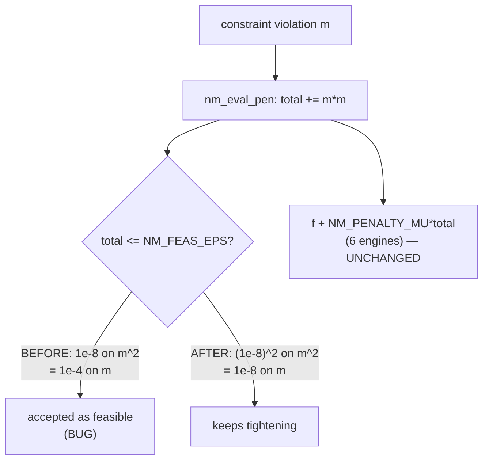

# NMinimize Constrained-Feasibility Fix Implementation Plan

## TL;DR

`NMinimize` returns points violating their constraints by ~1e-4 because a squared
penalty is tested against a tolerance meant for an unsquared one. We square the tolerance
where it is defined, leaving the penalty quantity untouched so the six engines that do
arithmetic on it are bit-identical. Risk is a slowdown in constrained solves, checkpointed
at 3x. Verified by feasibility assertions that are two-sided, unlike every existing one.

## Overview

`nm_eval_pen` accumulates `sum of violation^2`. `NM_FEAS_EPS = 1e-8` is compared
against that total, so the tolerance a user actually experiences on a constraint violation
is `sqrt(1e-8) = 1e-4`. `NM_FEAS_FINAL = 1e-6` carries the identical ambiguity, giving
an effective `1e-3`.

The fix does not change what `nm_eval_pen` returns. Research established that six of
eight engines combine `f + NM_PENALTY_MU * p` arithmetically and feed the result to
Metropolis acceptance functions, NelderMead's simplex ranking, and DIRECT's convex-hull
geometry; rescaling the penalty would change what those algorithms search, not merely what
they accept. Instead we define each tolerance on the *actual* violation and square it at
the definition site, so the constant's units are explicit in code and cannot drift.

Separately, the test suite cannot currently distinguish the bug from the fix: every
feasibility assertion in `tests/test_nminimize.c` is a one-sided band that a violating
point already satisfies. We add two-sided assertions.

## Decisions

- **Square the tolerance at the definition site, don't normalise the penalty.** Chosen
  because `NM_PENALTY_MU = 1e6` is calibrated against the squared scale and five
  optimizers' search dynamics depend on it. Fixes the readability defect that caused the
  bug without disturbing a convention six call sites rely on.
- **`NM_FEAS_FINAL` keeps its current effective value (1e-3 on the violation).** The
  human's constraint was "no existing test flips to Infinity". Holding the effective value
  constant while making its units explicit achieves that with provably zero behaviour
  change on the give-up path.
- **Correctness over speed, with a checkpoint.** If constrained cases regress worse than
  ~3x against DEMO-1's baseline, stop and apply the pre-agreed fallback rather than absorb
  it silently.

## Non-goals

- Not changing what `nm_eval_pen` returns, and not re-tuning `NM_PENALTY_MU` or any
  engine's acceptance function.
- Not adding a warning when `NMinimize` returns an infeasible point. Recorded in
  `NMINIMIZE_FEASIBILITY_BUG.md` as follow-up; it is a user-visible behaviour change
  beyond "fix it and test it".
- Not fixing the `PenaltyFunction` tolerance-semantics wart (a custom non-squared penalty
  still changes the effective tolerance). Pre-existing, documented, out of scope here.
- Not touching `FindMinimum`'s local solver or `findmin_penalty.c` — research proved
  that path independent.

## Acceptance Criteria

| ID | Given | When | Then | Input | Expected |
|---|---|---|---|---|---|
| AC-1 | default method | inequality-constrained solve | returned point satisfies the constraint | `NMinimize[{x^2+y^2, x+y>=2},{x,y}]` | `x+y >= 2 - 1e-8` |
| AC-2 | default method | equality-constrained solve | returned point satisfies the equality | `NMinimize[{x^2+y^2, x+y==2},{x,y}]` | `Abs[x+y-2] < 1e-8` |
| AC-3 | default method | objective still correct | optimum unchanged | same as AC-1 | `Abs[f - 2] < 1e-6` |
| AC-4 | genuinely infeasible | empty feasible set | still returns Infinity | `NMinimize[{x, x>2 && x<1}, x]` | `Infinity` / `Indeterminate` |
| AC-5 | feasible but displaced | region expansion needed | still returns finite | `NMinimize[{(x-50)^2+(y-40)^2, x+y>=80},{x,y}]` | `< 1e-2` |
| AC-6 | all methods | constrained solve per method | every method feasible | NelderMead/RandomSearch/SA/DIRECT | violation `< 1e-6` |
| AC-7 | full suite | existing tests | no regression | `./nminimize_tests` | "All NMinimize tests passed." |
| AC-8 | benchmark | constrained speed | within checkpoint | exp-89 C1/C2 | `< 3x` DEMO-1 baseline |

## Open Questions

### Unresolved

_None._

### Resolved

- [x] Which fix approach? — Square the tolerance at the definition site. Revised after
  research refuted the norm approach (6 of 8 engines do arithmetic on the penalty).
- [x] Fix `NM_FEAS_FINAL` too? — Yes, same treatment; effective value held constant.
- [x] Acceptable speed cost? — Measure and report; stop at ~3x.
- [x] Fallback if the checkpoint trips? — Decouple DE's convergence gate
  (`nm_de.c:159`) from the feasibility predicate, keeping feasibility strict.
- [x] Is a feasibility test genuinely missing? — Yes; every existing check is one-sided.

## Requires Approval

_None._ Approach, speed checkpoint, and fallback all agreed before writing.

## Architecture Impact

- New services introduced: none
- APIs changed: none — `NMinimize`'s signature and return shape are unchanged
- Data crossing a service boundary: none
- New external dependency: none
- Deployment topology change: none

## Subsystems & Dependencies

- Subsystems touched: none declared (no docs exist under `thoughts/shared/subsystems/`)
- Interdependencies surfaced: none

## Risks and Rollback

_None — standard tier, no architectural impact._

---

## Current State Analysis

- `findmin_internal.h:444-446` — `NM_FEAS_EPS 1.0e-8`, `NM_FEAS_FINAL 1.0e-6`,
  `NM_PENALTY_MU 1.0e6`.
- `findmin_nm_common.c:230-268` — `nm_eval_pen`, `term = m * m`.
- `findmin_nm_common.c:287-293` — `nm_better`, both threshold tests.
- `findmin_nm_common.c:466` — `*pen_io <= NM_FEAS_EPS` in `nm_int_descent`.
- `nm_de.c:159,163` — convergence break reuses the same predicate.
- `nm_driver.c:453,456` — `NM_FEAS_FINAL`, twice.
- `tests/test_nminimize.c:137-144` — section 4, "Feasibility of the returned point",
  two loose one-sided checks.

## Desired End State

`NMinimize[{x^2+y^2, x+y>=2},{x,y}]` returns a point satisfying `x+y >= 2` to ~1e-8 or
better, with the objective still `2.0`. Both feasibility constants read as violation
tolerances in source. `./nminimize_tests` passes, including new two-sided assertions that
fail against the pre-fix binary.

### Key Discoveries
- `nm_eval_pen` has exactly one caller (`nm_eval`, `findmin_nm_common.c:273-284`) —
  the risk surface is closed and was fully enumerated.
- Six of eight engines do penalty arithmetic; only DE, RandomSearch, SHGO are
  comparison-only.
- The local polish uses `fm_eval_penalty`, a separate always-squared function with no
  `penalty_fn` parameter — provably unaffected.

## Components & Files Affected

| File | Change |
|---|---|
| `src/numerical_calculus/findmin_internal.h:444-445` | Define violation tolerances; derive the squared constants from them |
| `tests/test_nminimize.c:137-144` | Replace/extend section 4 with two-sided feasibility assertions |
| `tests/test_nminimize.c` (new tests) | Per-method feasibility (AC-6) |
| `docs/spec/changelog/2026-08-17.md` | Changelog entry |
| `NMINIMIZE_FEASIBILITY_BUG.md` | Mark resolved, record the revised approach |

## Core Flow Diagram



## Alternatives Considered

### Return `sqrt(total)` from `nm_eval_pen`
**Rejected because:** dimensionally cleaner, and the option originally chosen — but six of
eight engines feed the penalty into `f + 1e6*p` and then into Metropolis acceptance,
simplex ranking, or convex-hull slopes. Rescaling changes what they search.

### `sqrt(p)` at the four threshold sites only
**Rejected because:** equally safe for the engines, but duplicates the sqrt at four sites
that must stay in sync and puts one in DE's inner loop.

## Implementation Approach

One-file source change, then tests, then measurement. The source change is deliberately
tiny; the substance of this ticket is the test gap and the verification that six engines
are untouched.

## Phase 1: Fix the constants

### Changes Required

**File**: `src/numerical_calculus/findmin_internal.h`

```c
/* Feasibility tolerances are stated on the ACTUAL constraint violation, then
   squared here, because nm_eval_pen accumulates sum(violation^2) and every
   comparison below is against that squared total. Stating the violation and
   squaring at the definition site is what keeps the two in step: writing 1e-8
   directly here meant a 1e-4 tolerance on the real violation, which shipped as
   a correctness bug (NMINIMIZE_FEASIBILITY_BUG.md). Do not compare an unsquared
   quantity against these. */
#define NM_FEAS_VIOL        1.0e-8    /* selection: max violation called feasible */
#define NM_FEAS_EPS         (NM_FEAS_VIOL * NM_FEAS_VIOL)
#define NM_FEAS_FINAL_VIOL  1.0e-3    /* give-up: unchanged effective value */
#define NM_FEAS_FINAL       (NM_FEAS_FINAL_VIOL * NM_FEAS_FINAL_VIOL)
```

`NM_FEAS_FINAL` is numerically `1e-6`, identical to today — deliberately, so the
Infinity path cannot regress.

### Success Criteria

#### Automated Verification
- [ ] Builds clean: `make -j8` (GCC, `SDKROOT` set)
- [ ] `make check-c99` passes
- [ ] `NM_FEAS_FINAL` still evaluates to `1e-6`
- [ ] `./nminimize_tests` passes (AC-7)

#### Manual Verification
- [ ] `NMinimize[{x^2+y^2, x+y>=2},{x,y}]` returns `x+y >= 2` (AC-1)
- [ ] Six arithmetic engines confirmed untouched by inspection

---

## Phase 2: Close the test gap

### Changes Required

**File**: `tests/test_nminimize.c`, section 4

Two-sided assertions, in the file's existing `check_true` idiom:

```c
check_true("((x + y) /. Last[NMinimize[{x^2+y^2, x+y >= 2}, {x,y}]]) >= 2 - 1.*^-8");
check_true("Abs[((x + y) /. Last[NMinimize[{x^2+y^2, x+y == 2}, {x,y}]]) - 2] < 1.*^-8");
```

Plus per-method feasibility (AC-6).

### Success Criteria

#### Automated Verification
- [ ] New tests **fail against the pre-fix binary** — proving they close the gap
- [ ] New tests pass post-fix
- [ ] Full `./nminimize_tests` green (AC-7)

#### Manual Verification
- [ ] Assertions are two-sided, not one-sided bands

---

## Phase 3: Measure the speed checkpoint

### Changes Required

Re-run experiment 89 constrained rows; compare C1/C2 to DEMO-1 baseline (1.35x, 1.17x).

### Success Criteria

#### Automated Verification
- [ ] `python3 benchmarks/run_all.py --only 89 --check-labels` — 0 CHECK-FAIL
- [ ] C1/C2 within 3x of baseline (AC-8)

#### Manual Verification
- [ ] If >3x: STOP, apply the agreed fallback (decouple `nm_de.c:159`), report the number

## Testing Strategy

The decisive test is that the new assertions **fail on the pre-fix binary**. A feasibility
test that passes before and after proves nothing, which is exactly how the original 29
tests missed this.

### Edge Cases & Integration Scenarios
- Genuinely infeasible problems must still return `Infinity` (AC-4)
- Feasible-but-displaced must still return finite (AC-5)
- Mixed-integer constrained: integer rounding interacts with the tolerance

### Manual Testing Steps
1. Build pre-fix, run new tests, confirm they FAIL.
2. Apply Phase 1, rebuild, confirm they PASS.
3. Run full suite and experiment 89.

## Performance Considerations

DE's convergence break (`nm_de.c:159`) gates on the same predicate, so a tighter
threshold means DE keeps iterating on constrained problems. This is the expected cost and
the subject of the Phase 3 checkpoint.

## Migration Notes

None. No API, serialization, or option change.

## References

- Research: `thoughts/shared/tickets/DEMO-2/research.md`
- Root cause: `NMINIMIZE_FEASIBILITY_BUG.md`
- Speed baseline: `benchmarks/89-nminimize-nmaximize/README.md`
