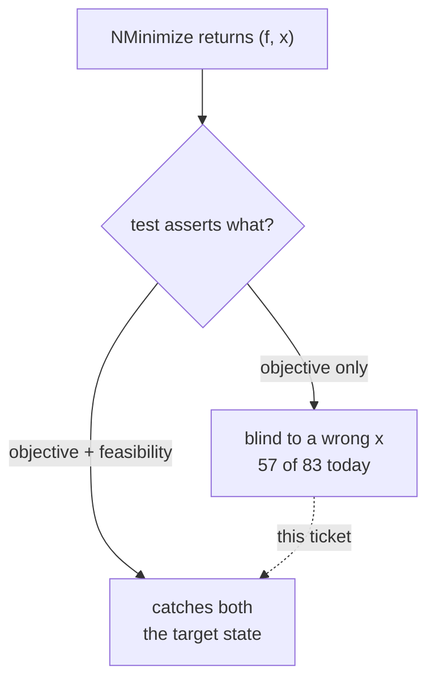

# NMinimize Test-Suite Tolerance Audit Fixes Implementation Plan

## TL;DR

The NMinimize suite tests the objective, not the answer: 32 constrained tests never check
their constraints, and 57 of 83 accept a point 10% wrong. We add feasibility assertions
where constraints are real, make ceilings two-sided where the constraint is an equality,
and explicitly document the omissions that are deliberate. Risk is that tightening exposes
real solver weaknesses. Success is measured by re-running the same mutation sweep.

## Overview

Two independent methods — structural classification of all 83 tests and a mutation sweep
that perturbs `nm_build_result` — agree that feasibility is systematically unasserted.
The defect is a missing category rather than carelessness: the file states a tolerance
policy that governs objectives and is silent on feasibility, so feasibility was handled ad
hoc by whoever wrote each test.

The fix therefore is not a numbers pass. It gives feasibility its own policy, states that
policy at the top of the file, applies it to the tests with genuine constraints, and
records as deliberate the places where a feasibility assertion would be vacuous.

Because the audit's own instrument produced one false headline before being corrected (a
stale build reported 0 of 83 catching an integer flip; the true figure is 7), every claim
this plan makes about improvement must be re-measured on a known-good build, not inferred.

## Decisions

- **Feasibility gets its own stated policy, written into the file's header.** The root
  cause is an absent category, so adding assertions without stating the rule would leave
  the next author in the same position.
- **Real constraints get assertions; box-only tests get a comment.** Asserting that a
  returned point lies inside its own search box is close to vacuous because the solver
  clamps to it, and a check that cannot fail is itself a form of tolerance-hiding. Making
  the omission explicit is more honest than making it look covered.
- **Assert against what the problem achieves, with margin — not against a constant.**
  DEMO-2 established that asserting exactly at a threshold tests the constant instead of
  the behaviour.
- **Re-measure with the same instrument.** The audit's number is the only non-circular
  way to show the fix worked.

## Non-goals

- Not changing any solver behaviour in `src/`. The mutation instrument added for the
  audit is removed before commit; it is a measuring tool, not a feature.
- Not tightening objective tolerances that are loose for a stated and defensible reason
  (stochastic global search genuinely varies run to run).
- Not fixing `test_fixed_charge_flow`'s open regression from DEMO-2 — separate ticket,
  already recorded in `NMINIMIZE_FEASIBILITY_BUG.md`.
- Not auditing other test files. The pattern likely repeats in `test_findmin*.c`, but
  this ticket is scoped to the NMinimize suite.

## Acceptance Criteria

| ID | Given | When | Then | Input | Expected |
|---|---|---|---|---|---|
| AC-1 | the suite as shipped | run unmutated | everything passes | `./nminimize_tests` | 83/83, exit 0 |
| AC-2 | each NEW assertion | run under `MATHILDA_MUTATE_PT=-0.01` | that assertion fails, proving it binds | per-assertion | every new assertion fails when mutated |
| AC-3 | the sweep | re-run on a forced-clean build | counts are REPORTED as measured, not predicted | sweep | number recorded, whatever it is |
| AC-4 | tests structurally immune to a mutation | classification | named and excluded from the counts | list | all-integer tests excluded from PT; integrality-only assertions excluded from INT |
| AC-5 | every constrained test with a real constraint | inspection | has a feasibility assertion | grep | 0 remaining |
| AC-6 | every constrained test without one | inspection | carries a comment saying why | grep | 0 silent omissions |
| AC-7 | the file header | inspection | states a feasibility policy distinct from the objective policy | read | present |
| AC-8 | the instrument (FOUR sites) | before commit | fully removed | `grep -rn "MATHILDA_MUTATE\|AUDIT_NOEXIT\|g_audit" src/ tests/` | 0 hits |
| AC-9 | the WHOLE tests/ tree | after removal | still builds | `make findmin_tests` (a second target) | links clean |

## Open Questions

### Unresolved

_None._

### Resolved

- [x] What counts as a finding? — Structural classification of all 83 plus mutation.
- [x] May I change what tests assert? — Yes, where shape analysis proves blindness.
- [x] The integer measurement gap? — Closed by `MATHILDA_MUTATE_INT`.
- [x] How to treat the box-only tests among the 32? — Assertions for real constraints;
  an explicit one-line comment for box-only, so no gap is silent.

## Requires Approval

_None._ Finding bar, fix scope, and the treatment of box-only tests were all settled
before this plan was written.

## Architecture Impact

- New services introduced: none
- APIs changed: none
- Data crossing a service boundary: none
- New external dependency: none
- Deployment topology change: none

## Subsystems & Dependencies

- Subsystems touched: none declared
- Interdependencies surfaced: none

## Risks and Rollback

No architectural impact, but two real risks.

**Tightening exposes genuine solver weakness.** It did twice in DEMO-2. Disposition rule,
following that precedent: file a solver ticket and KEEP the assertion — do not loosen a
correct assertion to accommodate a defect.

**The instrument breaks unrelated test binaries.** `tests/test_utils.h` is included by 434
test sources; an `extern` audit symbol defined in one file left every other binary
unlinkable — `findmin_tests` failed to link, verified, then fixed by making the symbol
per-translation-unit `static`. Rollback is `git checkout` of two test files and one source
file; nothing here ships to users.

---

## Current State Analysis

- `tests/test_nminimize.c:1-24` — tolerance policy covering objectives only.
- 32 constrained tests with no feasibility assertion; full list in
  `thoughts/shared/tickets/DEMO-3/research.md` §2.
- 17 one-sided ceilings; 2 tests assert feasibility but never the objective.
- Mutation baseline (known-good build): PT −1e-2 → 24 caught, PT −1e-1 → 26,
  OBJ +1e-1 → 60, INT +1 → 7.

## Desired End State

Every constrained test either asserts its constraints or says in a comment why it does
not. The file header states a feasibility policy separate from the objective policy. The
mutation sweep, re-run on a known-good build, shows materially more tests catching a wrong
point. No solver source is changed and the instrument is gone.

### Key Discoveries
- Objective-only tests are blind to a wrong point. A **two-sided** feasibility assertion
  catches either direction; a **one-sided ceiling catches only overshoot** and is blind to a
  point that falls SHORT — the direction the original bug went, and the direction
  `MATHILDA_MUTATE_PT` perturbs. That is why 19 tests carry feasibility assertions and only
  26 caught the sweep.
- The suite catches a wrong objective more than twice as well as a wrong point.
- No tolerance was ever widened to rescue a failing test across 37 commits.

## Components & Files Affected

| File | Change |
|---|---|
| `tests/test_nminimize.c:1-24` | Add the feasibility clause to the stated policy |
| `tests/test_nminimize.c:106-133` | Feasibility assertions on the six objective-only constrained tests |
| `tests/test_nminimize.c:220-249` | Feasibility/integrality assertions on the integer-domain tests |
| `tests/test_nminimize.c` (various) | Two-sided equality checks; comments on box-only omissions |
| `src/numerical_calculus/findmin_nm_common.c` | Remove the mutation instrument before commit |
| `tests/test_utils.h` | Restore `ASSERT_STR_EQ` to fail-fast before commit |

## Core Flow Diagram

## Alternatives Considered

### Tighten numbers only
**Rejected because:** it cannot fix the class. A test that never asserted feasibility is
still blind however tight its objective bound becomes.

### Add a feasibility assertion to all 32 uniformly
**Rejected because:** roughly half are box-only, where the solver clamps and the assertion
can never fail. A check that cannot fail makes the suite look more rigorous than it is,
which is the same failure this ticket exists to remove.

## Implementation Approach

Header policy first, so the rest of the change has a stated rule to follow. Then the real
constraint assertions, then the deliberate-omission comments, then re-measure. The
instrument is removed last, after the final sweep, because removing it earlier makes the
result unverifiable.

## Phase 1: State the policy

### Changes Required
**File**: `tests/test_nminimize.c`, header comment — add a feasibility clause: objective
tolerances may be loose because search is stochastic; feasibility tolerances are tight
because a point either satisfies its constraints or does not; where a feasibility bound
must be loose, the test says why.

### Success Criteria
#### Automated Verification
- [ ] Suite still passes: `./nminimize_tests` (AC-1)
#### Manual Verification
- [ ] Policy distinguishes objective from feasibility (AC-7)

---

## Phase 2: Assertions where constraints are real

### Changes Required

Classification RE-DERIVED from the constraint expressions, not inherited from research
List A's grouping — which misfiled several. Corrections verified against the source:

**REAL constraints -> add a feasibility assertion (this phase):**
`disk_linear`, `quadratic_linear`, `linear_program`, `equality_constraint`,
`chained_inequality`, `equation_system`, `penalty_function` (`x^2+y^2<=1`, a disk),
`symbol_indirection` (`x+y>=1`, a half-plane), `nmaximize_constrained` and
`min_max_duality` (`x^2+y^2<=1`), `region_expansion_rescue` (`x+y>=80`),
`integer_domain_value`, `integer_domain_alternatives`, `integer_domain_list`,
`mixed_integer`.

**BOX-only -> deliberate-omission comment (Phase 3):**
`sa_suboptions`, `griewank_simulatedannealing`, `sa_deceptive_landscapes`,
`schaffer2_simulatedannealing`, `griewank_differentialevolution`, `griewank_neldermead`,
`randomsearch_searchpoints_verbatim`, `bukin6_no_warning`, `search_points_honored`,
`de_options_effective`, `de_boundary_no_stagnation`, `gaussian_well`, `modified_ackley`,
`indexed_table_constraints`, `indexed_rosenbrock`, `indexed_real_coefficient`.

**UNCONSTRAINED -> reclassified OUT of List A, no box comment:**
`autocompile_parity_and_fallback` (`NMinimize[x^4-3x^2-x, x]` — verified unconstrained)
and `initial_points` case 3 (`(x-1)^2+(y+2)^2`). Writing "the box is enforced by
construction" on these would document something false. The "32" headline is therefore
**31 constrained**, and the audit document is corrected to match.

**Deferred, each with a stated reason:** `job_scheduling` (disjunctive precedence — a
correct assertion needs Or-semantics spelled out), `integer_domain_heads` (shape-only by
design), `infeasible` / `fixed_charge_flow` (assert Infinity; no point exists to check),
`memory_smoke` (not a correctness test).

Assert with margin against the measured residual — never at `NM_FEAS_RETURN_VIOL` (1e-5)
or `NM_FEAS_RANK_VIOL` (1e-4), which would test the constant rather than the behaviour.

### Success Criteria
#### Automated Verification
- [ ] Suite passes: `./nminimize_tests` (AC-1)
- [ ] New assertions fail under `MATHILDA_MUTATE_PT=-0.01` — proving they bind
#### Manual Verification
- [ ] No assertion written at exactly `NM_FEAS_RETURN_VIOL` or `NM_FEAS_RANK_VIOL`

---

## Phase 3: Document deliberate omissions

### Changes Required
One-line comment on each box-only method-regression test recording that the box is
enforced by construction so a feasibility assertion would be vacuous.

### Success Criteria
#### Automated Verification
- [ ] Every constrained test has either a feasibility assertion or such a comment (AC-5, AC-6)

---

## Phase 4: Re-measure and remove the instrument

### Changes Required
Re-run the sweep on a forced-clean build; record before/after in `thoughts/shared/tickets/DEMO-3/research.md` §1; then
remove the instrument from `findmin_nm_common.c` and restore `ASSERT_STR_EQ`.

### Success Criteria
#### Automated Verification
- [ ] PT −1e-2 ≥ 34, PT −1e-1 ≥ 36, INT +1 ≥ 10 (AC-2, AC-3, AC-4)
- [ ] `grep -r "MATHILDA_MUTATE\|AUDIT_NOEXIT" src/ tests/` returns nothing (AC-8)
- [ ] Suite passes unmutated, exit 0 (AC-1)
#### Manual Verification
- [ ] Sweep was run after a forced rebuild, not an incremental one

## Testing Strategy

The decisive check is that each new assertion **fails under mutation**. An assertion that
passes both mutated and unmutated is not testing anything — precisely the defect being
fixed. The AC targets are predictions and may prove wrong; if a target is missed the
number gets reported, not quietly adjusted.

### Edge Cases & Integration Scenarios
- Tests already asserting the point may catch mutations without new assertions.
- Tightening may expose genuine solver weakness (it did twice in DEMO-2).

### Manual Testing Steps
1. Force-rebuild, confirm baseline 83/83 and 0 mutation failures unmutated.
2. Run each mutation, record counts.
3. Remove instrument, rebuild, confirm suite still green.

## Performance Considerations

Additional assertions re-solve some problems, lengthening the suite. Acceptable; reuse
`sol` within a single `Module` rather than re-solving where possible.

## Migration Notes

None.

## References

- Research: `thoughts/shared/tickets/DEMO-3/research.md`
- Origin: `NMINIMIZE_FEASIBILITY_BUG.md`, "second confirmed instance"
