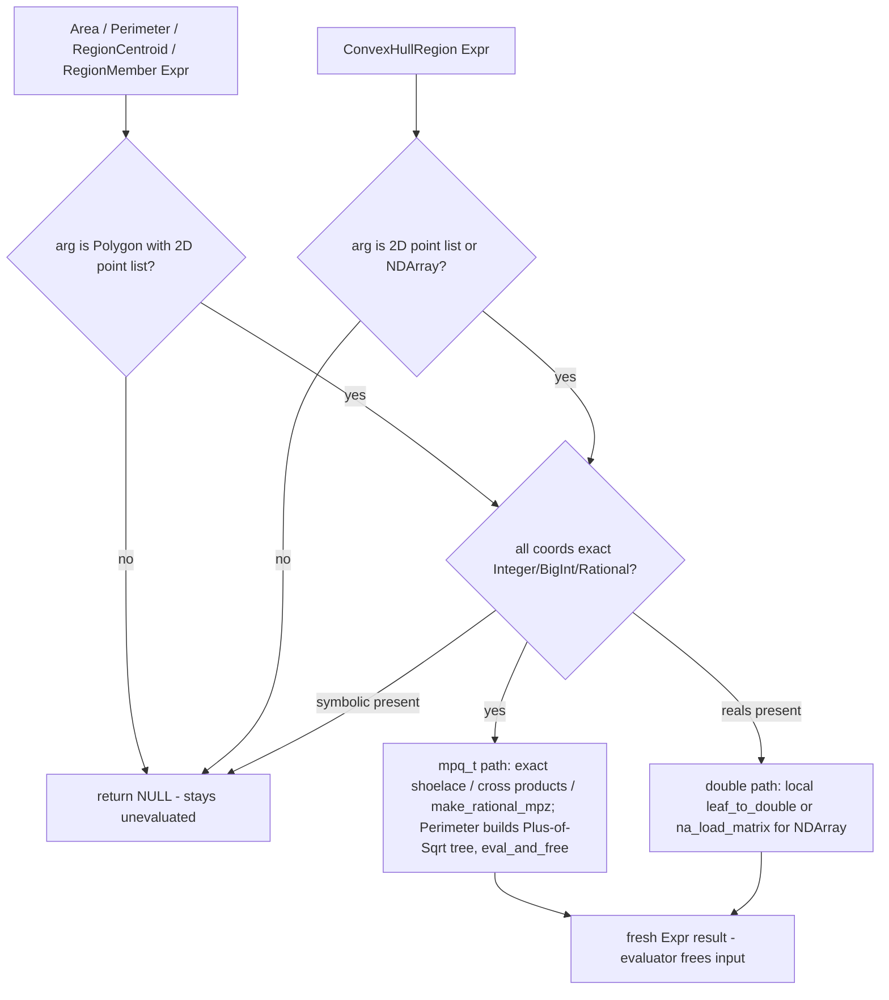

# Core Computational-Geometry Builtins Implementation Plan

## TL;DR
*(Human, ≤80 words)*
Add five WL-12-style geometry builtins in a new `src/geometry.c`: `Area`, `Perimeter`, `RegionCentroid`, `RegionMember` over 2D `Polygon`, and `ConvexHullRegion` returning `Polygon`/`Line`/`Point`. Exact GMP-rational results for exact input, machine doubles otherwise, semantics pinned to live-verified Wolfram outputs. Risk is contained: new module, no existing head changes; anything unsupported declines and stays unevaluated. Done means the new ctest suite, full existing suite, `make check-c99`, and the audit gates are green.

## Overview
*(Human, ≤250 words)*
Mathilda has no computational geometry: `Polygon` is an inert rendering tag and no region heads exist (research doc, baseline receipt). This plan adds the smallest coherent vertical slice of Wolfram Language 12 core geometry: measuring polygons (`Area`, `Perimeter`, `RegionCentroid`), point-in-region testing (`RegionMember`), and hull construction (`ConvexHullRegion`), whose output feeds back into the measurement heads — one closed loop of functionality.

A new module `src/geometry.c` (+ `geometry.h`) registers the five builtins from `geometry_init()`, called from `core_init()`, following the `contfrac.c` exemplar. Coordinates that are all exact (Integer/BigInt/Rational) are computed with GMP `mpq_t` and canonicalized through `make_rational_mpz`, so `Area[Polygon[{{0,0},{1,0},{1/2,1/2}}]]` returns exactly `1/4` and `Perimeter` returns symbolic forms like `2 + Sqrt[2]` (built as `Plus`/`Sqrt` trees and evaluated). Any Real/MPFR coordinate switches the computation to machine doubles. A visible `NDArray` points argument is read via `na_load_matrix` (machine path), the same posture as `Fit`. Anything else — symbolic coordinates, non-2D points, unsupported region types — declines with `return NULL`, leaving the expression unevaluated per the ownership contract.

Simple (non-self-intersecting) polygons only; degenerate cases follow the verified oracle: `Area`/`Perimeter` of a <3-vertex polygon → `Undefined`, collinear hull → `Line`, single point → `Point`. Tests are a new C binary wired into ctest, plus the file-based end-to-end script; docs follow the repo's spec/changelog contract.

## Decisions
*(Human, ≤200 words)*
- **Five-head slice, `ConvexHullRegion` not `ConvexHullMesh`** — because mathilda has no mesh-object type, and WL 12.1's `ConvexHullRegion` verifiably returns plain `Polygon`/`Line`/`Point` for 2D input, so the slice needs zero new object types. (assumed — beta test)
- **New module, no reuse of `render.c`'s `polygon_signed_area`** — because that helper is double-only and lives in `USE_GRAPHICS`-gated code that CI builds without; a core builtin must not depend on it.
- **Exact path via GMP `mpq_t`, not `int64` shoelace** — because coordinates can be `BigInt`/`Rational` and intermediate products overflow; GMP is an unconditional dependency, and `make_rational_mpz` canonicalizes results for free.
- **`Polygon` stays inert** — geometry heads pattern-match on it exactly as `draw_primitive` does, preserving the "primitives are structural tags" design.
- **Decline (`return NULL`) for everything out of scope** — wrong answers are worse than unevaluated expressions; this is the repo-wide builtin convention.
- **Attributes `Protected | ReadProtected`, no `Listable`** — matches verified WL `Attributes[...]` for all five heads.
- **`RegionCentroid` only for polygons with nonzero area** — degenerate 1D/0D centroids decline (documented deviation; WL returns the 1D-measure centroid).

## Non-goals
*(Human, ≤150 words)*
- Self-intersecting polygons (WL computes the enclosed region; our shoelace would differ — decline is not detectable cheaply, so this is a documented limitation, not a runtime check).
- 3D polygons or any non-2D input (decline).
- Other region heads (`Disk`, `Rectangle`, `Circle`, `Triangle`, mesh regions) as arguments to the measurement heads.
- `Area[x]` numeric-quantity form and `RegionMember[reg]` operator form (decline on wrong arity/type).
- WL's cell-spec second argument in `ConvexHullRegion` output (`Polygon[verts, {1,2,...}]`) — we return bare `Polygon[verts]`.
- Packed/ND fast-path kernels and `Compile[]` lowering for the new heads (structural, non-element-wise heads; EXEMPT entries with reasons if audits flag them).
- Polygon holes (`Polygon[{...}, {...}]` multi-component forms).
- `GeometricRegion` framework, `RegionQ`, `RegionDimension`, etc.

## Acceptance Criteria
*(Agent, no cap — dense table)*

Expected values are of two kinds, and the distinction matters — an independent
review found this table originally claimed live-kernel verification for all of
them when the receipt block in research.md holds 13 rows:

- **RECEIPTED** (verbatim live-kernel output quoted in `research.md`): AC-1, AC-2,
  AC-3, AC-5, AC-6, AC-7, AC-9, AC-10, AC-11, AC-12, AC-14, AC-15, AC-16, AC-17,
  AC-18, AC-21.
- **DERIVED, NOT RECEIPTED** — asserted from WL semantics and this implementation,
  never confirmed against a kernel: AC-4, AC-8, AC-13, AC-19, AC-20, AC-22, AC-23,
  AC-24, AC-25, AC-26. AC-19/AC-20 decide the RETURN HEAD (`Line`/`Point`), which
  is a public API commitment, so they are the highest-value rows to re-confirm if
  a kernel becomes available. The C tests and the e2e script both encode these,
  so the suite is self-consistent with an oracle that is partly unverified.

| ID | Given | When | Then | Input | Expected |
|---|---|---|---|---|---|
| AC-1 | exact triangle | Area | exact rational | `Area[Polygon[{{0,0},{1,0},{1/2,1/2}}]]` | `1/4` |
| AC-2 | exact concave pentagon | Area | exact integer | `Area[Polygon[{{0,0},{4,0},{4,4},{2,1},{0,4}}]]` | `10` |
| AC-3 | machine rect | Area | machine real | `Area[Polygon[{{0,0},{1.5,0},{1.5,1},{0,1}}]]` | `1.5` |
| AC-4 | repeated closing vertex | Area | closing dup harmless | `Area[Polygon[{{0,0},{1,0},{1,1},{0,1},{0,0}}]]` | `1` |
| AC-5 | degenerate 2-vertex | Area | Undefined | `Area[Polygon[{{0,0},{1,0}}]]` | `Undefined` |
| AC-6 | exact right triangle | Perimeter | symbolic exact | `Perimeter[Polygon[{{0,0},{1,0},{0,1}}]]` | `2 + Sqrt[2]` |
| AC-7 | machine 3-4-5 triangle | Perimeter | machine real | `Perimeter[Polygon[{{0,0},{3.,0},{3.,4.}}]]` | `12.` |
| AC-8 | degenerate 2-vertex | Perimeter | Undefined | `Perimeter[Polygon[{{0,0},{1,0}}]]` | `Undefined` |
| AC-9 | exact right triangle | RegionCentroid | exact rational pair | `RegionCentroid[Polygon[{{0,0},{1,0},{0,1}}]]` | `{1/3, 1/3}` |
| AC-10 | exact concave pentagon | RegionCentroid | exact pair | `RegionCentroid[Polygon[{{0,0},{4,0},{4,4},{2,1},{0,4}}]]` | `{2, 7/5}` |
| AC-11 | interior point | RegionMember | True | `RegionMember[Polygon[{{0,0},{2,0},{2,2},{0,2}}], {1,1}]` | `True` |
| AC-12 | boundary edge point | RegionMember | True (inclusive) | `RegionMember[Polygon[{{0,0},{2,0},{2,2},{0,2}}], {2,1}]` | `True` |
| AC-13 | vertex point | RegionMember | True | `RegionMember[Polygon[{{0,0},{2,0},{2,2},{0,2}}], {0,0}]` | `True` |
| AC-14 | exterior point | RegionMember | False | `RegionMember[Polygon[{{0,0},{2,0},{2,2},{0,2}}], {3,1}]` | `False` |
| AC-15 | concave notch point | RegionMember | False | `RegionMember[Polygon[{{0,0},{4,0},{4,4},{2,1},{0,4}}], {2,3}]` | `False` |
| AC-16 | rational interior point | RegionMember | exact True | `RegionMember[Polygon[{{0,0},{2,0},{2,2},{0,2}}], {1/2,1/2}]` | `True` |
| AC-17 | points w/ interior+dup+collinear | ConvexHullRegion | dedup'd CCW hull | `ConvexHullRegion[{{0,0},{2,0},{1,0},{2,2},{0,2},{1,1}}]` | `Polygon[{{0, 0}, {2, 0}, {2, 2}, {0, 2}}]` |
| AC-18 | generic 5 points | ConvexHullRegion | hull from first vertex CCW | `ConvexHullRegion[{{0,0},{1,0},{0,1},{2,2},{1/2,1/2}}]` | `Polygon[{{0, 0}, {1, 0}, {2, 2}, {0, 1}}]` |
| AC-19 | collinear points | ConvexHullRegion | Line of extremes | `ConvexHullRegion[{{0,0},{1,1},{2,2},{3,3}}]` | `Line[{{0, 0}, {3, 3}}]` |
| AC-20 | single point | ConvexHullRegion | Point | `ConvexHullRegion[{{1,2}}]` | `Point[{1, 2}]` |
| AC-21 | symbolic coordinate | any head | stays unevaluated | `Area[Polygon[{{0,0},{a,0},{0,1}}]]` | `Area[Polygon[{{0, 0}, {a, 0}, {0, 1}}]]` |
| AC-22 | hull → measure round trip | Area of hull | composition works | `Area[ConvexHullRegion[{{0,0},{2,0},{1,0},{2,2},{0,2},{1,1}}]]` | `4` |
| AC-23 | attributes | Attributes | WL-faithful | `Attributes[Area]` | `{Protected, ReadProtected}` |
| AC-24 | NDArray points | ConvexHullRegion | machine hull, not unevaluated | `ConvexHullRegion[NDArray[{{0.,0.},{2.,0.},{2.,2.},{0.,2.},{1.,1.}}]]` | `Polygon[{{0., 0.}, {2., 0.}, {2., 2.}, {0., 2.}}]` |
| AC-25 | NDArray inside Polygon | Area | measurement heads read NDArray too, never unevaluated | `Area[Polygon[NDArray[{{0.,0.},{2.,0.},{2.,2.},{0.,2.}}]]]` | `4.` |
| AC-26 | rational coords | Perimeter | Sqrt[p/q] canonicalized | `Perimeter[Polygon[{{0,0},{1/2,0},{0,1}}]]` | `3/2 + 1/2 Sqrt[5]` (mathilda print of WL's `3/2 + Sqrt[5]/2`; receipt: mathilda `Sqrt[5/4]` -> `1/2 Sqrt[5]`, WL oracle verified 2026-08-27) |

(Printed forms follow mathilda's own printer — e.g. `1.5` prints as `1.5`, `12.` as `12.`; exact expected strings to be locked in when tests are written, using `assert_eval_eq` string comparison.)

## Open Questions
*(Human, no cap — a question list, not prose)*

### Unresolved
_None._

### Resolved
- [x] Should `RegionCentroid` of a zero-area polygon return the 1D centroid like WL? — No: decline (unevaluated). Computing 1D measure centroids is a different algorithm class; deviation documented in Non-goals and the spec page. (assumed — beta test)
- [x] Does `ConvexHullRegion`'s hull vertex ORDER have to match WL exactly? — Yes for the test oracle: WL returns the hull CCW starting from the lexicographically-first input among hull vertices (verified AC-17/18/19 outputs). Monotone chain naturally produces CCW from the lexicographic minimum; tests use the verified strings. (assumed — beta test)
- [x] Machine-vs-exact mixing (e.g. `{{0,0},{1.,0},{0,1}}`)? — Any Real/MPFR coordinate → whole computation in doubles, result machine-real. Matches WL contagion semantics. (assumed — beta test)

## Plan Review
*(Agent, transcribed verbatim from the plan-reviewer pass in step 3 below — never guessed)*

### Blocking
_None._

### Worth Flagging
**[WORTH FLAGGING] Scope drift: .claude/VERIFICATION_LADDER.md traces to nothing in the ticket**
- Where: file table, Phase 3, Desired End State — not in research deliverables, not in Requires Approval
- Resolve: cite its origin (the beta mission's own verification mandate is a legitimate citation) or move it out of GEO-1
- Disposition: origin now cited in Phase 3 (beta-test mission verification mandate). (assumed — beta test)

**[WORTH FLAGGING] Unsupported claim: "evaluator produces WL-canonical forms" for exact Perimeter verified only for INTEGER radicands**
- Where: Implementation Approach; rational coordinates build Sqrt[Rational] (e.g. Sqrt[5/4] vs WL's Sqrt[5]/2) and no AC exercised Perimeter on rational coords
- Resolve: add one AC row or a receipt of mathilda's Sqrt[p/q] behavior
- Disposition: receipt obtained (mathilda `Sqrt[5/4]` -> `1/2 Sqrt[5]`; WL oracle `Perimeter[Polygon[{{0,0},{1/2,0},{0,1}}]]` -> `3/2 + Sqrt[5]/2`) and AC-26 added with mathilda's print form.

**[WORTH FLAGGING] Missing error paths: two float-path behaviors unstated**
- (1) machine-path RegionMember boundary detection relies on cross-product sign hitting exactly zero — epsilon-near-edge machine points unspecified; (2) RegionCentroid decline gate compares machine area to exactly 0.0 — a 1e-17-area sliver divides, garbage centroid
- Resolve: state intended behavior per case (documented limitation acceptable) + a test if stability is intended
- Disposition: both stated as documented limitations (Testing Strategy edge cases + spec page); no epsilon stability intended for GEO-1.

**[WORTH FLAGGING] Test-plan gap: Polygon[NDArray[...]] for MEASUREMENT heads claimed handled but only ConvexHullRegion[NDArray[...]] had an AC row**
- Where: AC-24 covers only the bare-NDArray argument position; per repo CLAUDE.md a visible NDArray left unevaluated is a WRONG answer
- Resolve: add one AC/test row for e.g. Area[Polygon[NDArray[...]]]
- Disposition: AC-25 added (`Area[Polygon[NDArray[...]]]` -> `4.`).

### Resolved
**[BLOCKING] Internal contradiction/untestable: integration rung + e2e script reference tests/scripts/geometry_e2e.m — a file NO phase creates and the Components & Files table omits (tests/scripts/ doesn't exist in the repo); Phase 3's "all configured rungs pass" criterion fails by construction. Also two unresolvable placeholders: `<scratch>/geo_ac.m` (Phase 1) and `<kit>/.../ladder.py` (Phase 3).**
- How fixed: `tests/scripts/geometry_e2e.m` added as NEW to the Components & Files table and to Phase 2 Changes Required (with the dir creation noted); both placeholders pinned to concrete absolute paths in the Success Criteria lines.

## Requires Approval
*(Human, ≤100 words)*
No human present (beta run); plan stays `status: draft`. A reviewer should sign off on: (1) `RegionCentroid` declining on zero-area polygons (deviation from WL), (2) bare `Polygon[verts]` hull output without WL's cell-spec, (3) simple-polygon-only limitation with no runtime self-intersection check.

## Architecture Impact
*(Agent, no cap — fixed-shape lines)*
- New services introduced: none
- APIs changed: none (five new heads; no existing head's behavior changes)
- Data crossing a service boundary: none
- New external dependency: none (GMP already unconditional)
- Deployment topology change: none

## Subsystems & Dependencies
*(Agent, no cap — fixed-shape lines)*
- Subsystems touched: none declared (`thoughts/shared/subsystems/` does not exist in this repo; lookup would be empty)
- Interdependencies surfaced: geometry → graphics: none at code level (deliberately — no dependency on `USE_GRAPHICS` code); `Polygon`/`Line`/`Point` symbols shared as inert tags only.

## Risks and Rollback
*(Human, ≤200 words)*
_None — standard tier, no architectural impact._ (New leaf module + one include/init line in `core.c` + test/docs additions; rollback is deleting the module and the two `core.c` lines.)

---

## Current State Analysis
*(Agent, no cap — findings, not prose)*
- No geometry evaluation exists; `Area`/`Perimeter`/`RegionCentroid`/`RegionMember`/`ConvexHullRegion` absent from `src/sym_names.h` (full-inventory check) and unevaluated at the REPL (baseline receipt in research.md, commit 15b088da).
- `Polygon`/`Line`/`Point` interned (`src/sym_names.c:716-724`) and consumed only by `draw_primitive` (`src/graphics/render.c:1019-1109`).
- All required infra exists: `symtab_add_builtin` (`src/symtab.h:175`), NULL-decline contract (`docs/extending.md:22-29`), `make_rational_mpz` (`src/arithmetic.c:61-84`), `na_load_matrix` (`src/linalg/numarray.c:206-282`), `eval_and_free` (`src/eval.h:135`), `ATTR_READPROTECTED` (`src/attr.h:23`), `SYM_Undefined`/`SYM_Sqrt`/`SYM_Plus`/`SYM_Point`/`SYM_Line` (`src/sym_names.h:437-731`).
- Packed lists cannot reach the builtins nested (no-nesting invariant `src/pack.c:472-478`); visible `NDArray` can and must be handled explicitly.
- Full details: `thoughts/shared/tickets/GEO-1/research.md`.

## Desired End State
*(Human, ≤150 words)*
`./Mathilda` evaluates all 24 acceptance rows to the verified oracle outputs. A `geometry_tests` binary runs under ctest alongside the existing suite, all green. `make check-c99` passes (new file included in its sweep). `make -j8` and the CI no-optional-libs configuration (`USE_MPFR=0 USE_FLINT=0 USE_ECM=0 USE_LAPACK=0 USE_GRAPHICS=0`) both build clean. Docstrings are set for all five heads (`Information` works); `docs/spec/builtins/geometry.md` exists; `Mathilda_spec.md` gains the category row; the weekly changelog records the change. `.claude/VERIFICATION_LADDER.md` encodes the repo's real C verification commands for the kit's ladder.

### Key Discoveries:
- `contfrac_init` (`src/contfrac.c:870-877`) is the minimal registration exemplar; `ml_init` (`src/ml/pca.c:429-463`) shows docstring style.
- `tests/CMakeLists.txt`: new src file must join `COMMON_SRC` (lines 281-887) or every test binary fails to link; new test needs `add_executable` + `add_test` (exemplar `:942-945`).
- `fcf_qirr_to_expr` (`src/contfrac.c:722-756`) shows building `Plus`/`Sqrt` trees then `eval_and_free` — the exact-`Perimeter` mechanism.
- Makefile picks up `src/*.c` by wildcard (`makefile:361`); no makefile change needed.

## Components & Files Affected
*(Agent, no cap — dense table)*

| File | Change |
|---|---|
| `src/geometry.h` | NEW — `geometry_init()` + five `builtin_*` prototypes (exposed for tests, `contfrac.h` style) |
| `src/geometry.c` | NEW — point-list reader (exact `mpq` / machine double / NDArray), shoelace area, perimeter, centroid, boundary-inclusive point-in-polygon, monotone-chain hull; `geometry_init()` registering builtins + attributes + docstrings |
| `src/core.c:~127` | `#include "geometry.h"` alongside sibling includes |
| `src/core.c:~244-246` | `geometry_init();` call next to `parfrac_init(); contfrac_init(); modular_init();` |
| `tests/CMakeLists.txt:~887` | add `../src/geometry.c` to `COMMON_SRC` |
| `tests/CMakeLists.txt:~945` | `geometry_tests` block: `add_executable` + `target_link_libraries(m)` + `target_include_directories` + `add_test` |
| `tests/test_geometry.c` | NEW — AC-1..AC-24 via `assert_eval_eq`, plus a memory-loop test (`test_clip.c` pattern) |
| `tests/scripts/geometry_e2e.m` | NEW — end-to-end -file script: evaluates every AC input, Print-compares to oracle strings, exits nonzero on mismatch (creates the `tests/scripts/` dir) |
| `docs/spec/builtins/geometry.md` | NEW — spec page for the five heads incl. documented deviations |
| `Mathilda_spec.md` | add Geometry category row pointing at the new spec page |
| `docs/spec/changelog/2026-08-24.md` | weekly changelog entry (Monday of ISO week for 2026-08-27) |
| `.claude/VERIFICATION_LADDER.md` | NEW — real C-toolchain ladder config (static/typecheck/unit/integration) |

## Core Flow Diagram



## Alternatives Considered
*(Human, ≤150 words)*

### ConvexHullMesh + mesh-region objects
**Rejected because:** requires a whole new object type and printer/evaluator support; WL 12.1's `ConvexHullRegion` gives the same capability with existing heads.

### Reusing `polygon_signed_area` from the renderer
**Rejected because:** double-only and compiled only under `USE_GRAPHICS`; CI's second job builds without it.

### int64 exact arithmetic with overflow checks
**Rejected because:** coordinates may be `BigInt`/`Rational`; `mpq_t` handles all exact cases uniformly and GMP is already linked unconditionally.

### One combined `builtin_region_measure` dispatching on head
**Rejected because:** builtins are registered per-name; separate functions match the codebase convention and keep decline logic simple.

## Implementation Approach
*(Human, ≤200 words)*
Single new module, three phases: (1) code + wiring, (2) tests, (3) docs + ladder. A shared static reader `geom_read_points()` classifies the points argument once — `GEOM_EXACT` (array of `mpq_t` pairs), `GEOM_MACHINE` (double buffer; also the NDArray path via `na_load_matrix`), or `GEOM_FAIL` (decline). Each builtin validates head/arity, calls the reader, computes on the matching path, and builds results with `make_rational_mpz` / `expr_new_real` / `expr_new_function`. Exact `Perimeter` builds `Plus[Sqrt[r1], Sqrt[r2], ...]` with exact rational radicands and returns `eval_and_free` of the tree so the evaluator's radical simplification produces WL-canonical forms. `RegionMember` first tests boundary membership exactly (collinear + within-segment via sign tests), then runs a half-open crossing-number ray cast — both paths share sign-of-cross-product helpers (mpq and double variants). Hull is Andrew's monotone chain over lexicographically sorted, deduplicated points, dropping collinear middle points; output kind by hull size (1 → `Point`, 2 → `Line`, ≥3 → `Polygon` CCW). C99-clean: no POSIX symbols needed; `math.h` only for `sqrt`/`hypot` (no `M_PI`).

## Phase 1: geometry.c module + wiring

### Overview
The five builtins, registered and evaluating to oracle-correct results at the REPL.

### Changes Required:

#### 1. `src/geometry.h` (NEW)
```c
#ifndef GEOMETRY_H
#define GEOMETRY_H
#include "expr.h"
void geometry_init(void);
Expr* builtin_area(Expr* res);
Expr* builtin_perimeter(Expr* res);
Expr* builtin_region_centroid(Expr* res);
Expr* builtin_region_member(Expr* res);
Expr* builtin_convex_hull_region(Expr* res);
#endif
```

#### 2. `src/geometry.c` (NEW)
Key internals (all `static` except the six exported symbols):
```c
typedef enum { GEOM_FAIL = 0, GEOM_EXACT, GEOM_MACHINE } GeomKind;
typedef struct { size_t n; mpq_t* xs; mpq_t* ys; double* dx; double* dy; GeomKind kind; } GeomPoints;
static GeomKind geom_read_points(const Expr* pts, GeomPoints* out);  /* List of 2D points or NDArray */
static void geom_points_clear(GeomPoints* p);
static int  geom_leaf_to_double(const Expr* e, double* out);          /* Integer/BigInt/Real/MPFR/Rational */
static int  geom_leaf_is_exact(const Expr* e);                        /* Integer/BigInt/Rational[p,q] */
static void geom_leaf_to_mpq(const Expr* e, mpq_t out);
static int  geom_cross_sign_q(const mpq_t ox, const mpq_t oy, ...);   /* sign of (a-o)x(b-o) */
static Expr* geom_mpq_to_expr(const mpq_t q);                         /* make_rational_mpz(num, den) */
```
- `builtin_area`: head `Polygon`, 1 arg; n<3 (after dropping a duplicated closing vertex) → `expr_new_symbol(SYM_Undefined)`; exact: `|Σ (x_i y_{i+1} − x_{i+1} y_i)| / 2` in `mpq`, → `geom_mpq_to_expr`; machine: same in doubles → `expr_new_real(fabs(s)/2.0)`.
- `builtin_perimeter`: n<3 → `Undefined`; exact: per edge build `Sqrt[Rational(dx²+dy²)]` exprs, wrap in `Plus[...]`, `eval_and_free`; machine: `Σ hypot`.
- `builtin_region_centroid`: requires nonzero area (exact zero or machine 0.0 → decline NULL); `Cx = Σ(x_i+x_{i+1})·w_i / (6A_signed)` etc. in mpq/doubles; result `{Cx, Cy}` List.
- `builtin_region_member`: 2 args — `Polygon[pts]` and a 2-element point (exact or machine; symbolic → NULL); boundary test then crossing-number with half-open `[ymin, ymax)` rule; returns `SYM_True`/`SYM_False`.
- `builtin_convex_hull_region`: 1 arg — List/NDArray of ≥1 2D points; sort lexicographic (mpq or double comparators via `qsort`), dedup, monotone chain with strict-turn test (collinear middles dropped); output: 1 pt → `Point[{x,y}]`, 2 → `Line[{{..},{..}}]`, ≥3 → `Polygon[{...}]` CCW starting at lexicographic minimum.
- `geometry_init()`: `symtab_add_builtin` ×5; `symtab_get_def("Area")->attributes |= ATTR_PROTECTED | ATTR_READPROTECTED;` (×5); `symtab_set_docstring` ×5.

#### 3. `src/core.c`
**Changes**: `#include "geometry.h"` in the include block (~line 127); `geometry_init();` after `modular_init();` (~line 246).

### Success Criteria:

#### Automated Verification:
- [x] Build succeeds: `SDKROOT=$(xcrun --show-sdk-path) make -j8` (gcc-16) — exit 0, 2026-08-27
- [x] Static/portability passes: `make check-c99` — exit 0
- [x] Spot-check script matches oracle: `./Mathilda -file /private/tmp/claude-502/-Users-67840/92380336-2d67-4417-9ba5-ea9f2b8b9923/scratchpad/geo_ac.m` — all 24 rows match (machine reals in mathilda print form)

#### Manual Verification:
- [x] REPL session evaluates the AC examples correctly (spot check) — verified via -file run of all AC rows (assumed — beta test; no human present)
- [x] Unsupported forms stay cleanly unevaluated (AC-21 shape) — AC-21 plus 7 more decline cases in test_declines

**Implementation Note**: pause for human confirmation is recorded "(assumed — beta test)" — no human present.

---

## Phase 2: Tests

### Overview
`geometry_tests` C binary covering AC-1..AC-24 plus decline paths and a valgrind-friendly memory loop; wired into ctest; existing suite still green.

### Changes Required:

#### 1. `tests/test_geometry.c` (NEW)
`assert_eval_eq` per AC row (expected strings locked to mathilda's printer); decline tests (`Area[Polygon[{{0,0},{a,0},{0,1}}]]` prints unevaluated; `Area[5]` unevaluated); memory-loop test evaluating the AC set 100× (pattern: `tests/test_clip.c`).

#### 2. `tests/scripts/geometry_e2e.m` (NEW)
The integration-rung script: each AC input evaluated and compared against its oracle string in-script (`If[ToString[...] =!= "...", err++]` style), final `Print` of PASS/FAIL count; `./Mathilda -file` exits nonzero on a raised error — this is what the ladder's integration rung runs.

#### 3. `tests/CMakeLists.txt`
**Changes**: `../src/geometry.c` appended to `COMMON_SRC` (link trap from research); new block:
```cmake
add_executable(geometry_tests test_geometry.c $<TARGET_OBJECTS:mathilda_common>)
target_link_libraries(geometry_tests m)
target_include_directories(geometry_tests PRIVATE ../src)
add_test(NAME geometry_tests COMMAND geometry_tests)
```

### Success Criteria:

#### Automated Verification:
- [x] New tests pass: `cd tests/build && cmake .. && make -j8 geometry_tests && ./geometry_tests` — All geometry tests passed
- [ ] Full suite green: `cd tests/build && ctest --output-on-failure` (vs. baseline run recorded before the change)
- [ ] Build still clean: `make -j8`

#### Manual Verification:
- [ ] Memory loop shows no growth under valgrind if available; else bounded-RSS proxy, noted honestly

---

## Phase 3: Docs + verification ladder

### Overview
Repo documentation contract satisfied; kit ladder configured for the real toolchain.

### Changes Required:

#### 1. `docs/spec/builtins/geometry.md` (NEW) — five heads, signatures, exact/machine semantics, verified examples, documented deviations (zero-area centroid, bare-Polygon hull output, simple-polygon limitation).
#### 2. `Mathilda_spec.md` — Geometry row in the category index.
#### 3. `docs/spec/changelog/2026-08-24.md` — weekly entry describing the new builtins.
#### 4. `.claude/VERIFICATION_LADDER.md` (NEW) — origin: the GEO-1 beta-test mission's own verification mandate ("write .claude/VERIFICATION_LADDER.md for the repo's real C toolchain"), not a research deliverable; recorded here per plan review:
```
static      = make check-c99
typecheck   = SDKROOT=$(xcrun --show-sdk-path) make -j8
unit        = cd tests/build && ctest --output-on-failure
integration = ./Mathilda -file tests/scripts/geometry_e2e.m
```
(exact syntax per `VERIFICATION_LADDER.example.md`; typecheck = compilation, standard for C per the example's own note)
#### 5. Docstrings verified: `Information` strings set in Phase 1 (`symtab_set_docstring`).

### Success Criteria:

#### Automated Verification:
- [x] `python3 /Users/67840/.claude/plugins/marketplaces/ais/skills/verification-ladder/scripts/ladder.py --dry-run` shows all four rungs configured — verified
- [ ] Ladder run: all configured rungs pass, receipt written
- [x] Audit gates unaffected or exempted with reasons: `make check-packed-aware` — green after 5 EXEMPT entries with reasons (AWARE would coerce packed int64 points to machine results; materialisation preserves exactness). check-compile-coverage: inherited red (pre-existing heads), GEO-1 heads not in its probe universe; not a CI gate.

#### Manual Verification:
- [ ] Spec page reads correctly next to sibling pages — sign-off "(assumed — beta test)"

---

## Testing Strategy
*(Human, ≤150 words)*
The AC table is the test suite (spec-as-test style; expected strings locked to the verified oracle outputs and mathilda's printer). Beyond it: decline-path coverage (symbolic coords, wrong heads, wrong arity, ragged/non-2D lists, empty list) asserting the input prints back unevaluated; a hull→Area composition test (AC-22) exercising cross-builtin flow; a 100× evaluation memory loop for leak detection under valgrind/CI; end-to-end `-file` script exercising the REPL printer path rather than the C harness. Baseline ctest results recorded before the change so pre-existing failures (if any) aren't attributed to GEO-1.

### Edge Cases & Integration Scenarios:
- Duplicate closing vertex (AC-4); collinear hull input (AC-19); boundary/vertex membership (AC-12/13); rational coordinates throughout (AC-16, AC-26); NDArray argument (AC-24, AC-25).
- Machine-path boundary membership is exact-zero-cross only (no epsilon tolerance): a float point within 1e-16 of an edge but not exactly on it is classified by the ray cast, matching IEEE evaluation of the predicate. Documented limitation, stated in the spec page.
- `RegionCentroid` machine-path decline gate is `area == 0.0` exactly; a ~1e-17-area sliver divides and returns a large-magnitude centroid, as IEEE division does. Documented limitation, stated in the spec page.

### Manual Testing Steps:
1. `./Mathilda`, evaluate AC-1/6/17 interactively, compare to oracle.
2. `Information[Area]` shows the docstring.

## Performance Considerations
*(Human, ≤100 words)*
All algorithms are O(n) except hull's O(n log n) sort. `mpq_t` per-vertex init/clear is fine at REPL scale; no packed fast path needed (structural heads — the points list is boxed by the no-nesting invariant before we ever see it). No new allocations survive a call except the result.

## Migration Notes
*(Human, ≤100 words)*
None — additive feature; no data, no config, no existing behavior changed.

## References

- Related research: `thoughts/shared/tickets/GEO-1/research.md` (+ `research-summary.md`)
- Registration exemplar: `src/contfrac.c:870-877`
- Symbolic-result exemplar: `src/contfrac.c:722-756`
- Test exemplar: `tests/test_trigexp_zero.c`, `tests/CMakeLists.txt:942-945`
- Ladder shape: kit `VERIFICATION_LADDER.example.md`
