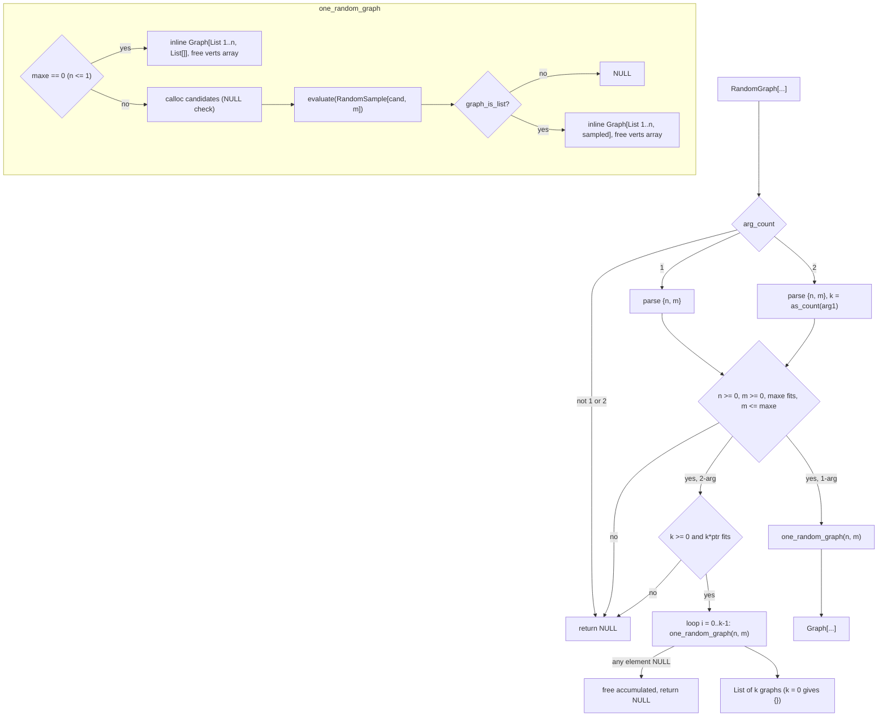

# `RandomGraph[{n, m}, k]` Implementation Plan

## TL;DR

Add the trailing-count form `RandomGraph[{n, m}, k]`, returning a `List` of `k`
independent random graphs. The single-graph body in `src/graph/generators.c:103-134` is
extracted into a static helper that both arities call; `k` is validated with the file's
existing `as_count`. Risk is contained to one function and one head. Verified by extending
`test_random_graph` plus a REPL check of the `k = 0`, `k = 1`, and invalid-`k` cases.

## Overview

`RandomGraph` today accepts exactly one argument — the gate is a literal
`arg_count != 1` at `src/graph/generators.c:104` — so `RandomGraph[{5, 4}, 3]` returns
unevaluated. Five sibling heads in `src/random.c` already implement the trailing-count
argument and agree unanimously on its conventions, so this change adds a sixth local copy
of that shape rather than inventing one.

The single-graph path stays exactly as it is: it samples by constructing and
`evaluate()`-ing a real `RandomSample[...]` call, which is what makes `SeedRandom`
reproducibility fall out for free. That coupling is load-bearing and is preserved, not
optimized away. The `k` form simply calls that path `k` times and collects the results.

Two things surface from the refactor. The helper keeps the current body's **inline**
assembly rather than adopting the file's `make_graph` helper, because `make_graph` neither
frees the C arrays it is handed nor accepts an already-built edge `List` — see Alternatives
Considered. And for `n <= 1` the candidate list is empty, which trips a guard inside
`RandomSample` and makes `RandomGraph[{0, 0}]` unevaluated today; an early return for that
one case fixes it as a side effect.

## Decisions

- **Flat `k` only.** The nested `RandomGraph[{n, m}, {k1, k2}]` form is out of scope, per
  the research's resolved question.
- **Extract a static helper, don't generalize.** No shared count-spec parser exists;
  `src/random.c` holds five hand-written copies, so a sixth local check is idiomatic here.
- **Keep the `evaluate(RandomSample[...])` round-trip.** It is why `SeedRandom` works.
- **Fix the `n <= 1` case incidentally** (chosen by the human, 2026-08-30). The helper
  early-returns an edgeless graph when `maxe == 0` — and **only** then, not when `m == 0`,
  which works today and must keep consuming the RNG stream identically.
- **Document the leak, don't cap `k`** (chosen by the human, 2026-08-30). No sibling
  `Random*` head restricts its count, and a cap would be a non-Mathematica restriction.
- **Free the C arrays this diff allocates**, keeping the assembly inline rather than
  calling `make_graph`, which frees nothing. `expr_new_function` memcpys
  (`src/expr.c:257`), so the caller owns the array. Leak (A), fixed only where the diff
  lands.
- **Fail unevaluated instead of crashing on an absurd `n` or `k`.** Compute `maxe` in
  `unsigned long long`, bound it against `SIZE_MAX`, and check both `calloc`s — no
  arbitrary cap, just the head's existing `NULL` error channel.

## Non-goals

- **The candidate-tree leak, Finding 4B** (~364 KB/call at n=50). Scoped out by research;
  documented rather than fixed. It multiplies by `k`.
- **Leak (A) in the other four generators** (`CompleteGraph`, `CycleGraph`, both
  `PathGraph` branches). Same one-line shape, but out of this diff.
- **The nested `{k1, k2}` dimension form.**
- **Reworking the O(n²) candidate materialization.** Explicitly resolved as out of scope.
- **Any packed/NDArray/`Compile[]` surface.** `RandomGraph` returns a `Graph` object, not a
  machine array — the "non-machine object" exemption CLAUDE.md names. Verified absent from
  `src/pack.c`'s `AWARE` list, `src/ndkernels.c`, `src/ndinteger.c`, and `src/compile/`.

## Acceptance Criteria

| ID | Given | When | Then | Input | Expected |
|---|---|---|---|---|---|
| AC-1 | the k form with k > 1 | called with n=6, m=5, k=3 | a List of k graphs is returned | `Length[RandomGraph[{6, 5}, 3]]` | `3` |
| AC-2 | the k form | each element is a valid simple graph on n vertices with m edges | every element satisfies GraphQ | `And @@ (GraphQ /@ RandomGraph[{6, 5}, 3])` | `True` |
| AC-3 | the k form | edge and vertex counts checked per element | each has n vertices and m edges | `Union[VertexCount /@ RandomGraph[{6, 5}, 3]]` | `{6}` |
| AC-4 | the k form | edge counts checked per element | each has exactly m edges | `Union[EdgeCount /@ RandomGraph[{6, 5}, 3]]` | `{5}` |
| AC-5 | k = 1 | called with n=6, m=5, k=1 | a one-element List, not a bare Graph | `Length[RandomGraph[{6, 5}, 1]]` | `1` |
| AC-6 | k = 0 | called with n=6, m=5, k=0 | the empty List | `RandomGraph[{6, 5}, 0]` | `{}` |
| AC-7 | negative k | called with k = -1 | unevaluated, no Message | `Head[RandomGraph[{6, 5}, -1]]` | `RandomGraph` |
| AC-8 | non-integer k | called with k = 2.5 | unevaluated | `Head[RandomGraph[{6, 5}, 2.5]]` | `RandomGraph` |
| AC-9 | symbolic k | called with k = q | unevaluated | `Head[RandomGraph[{6, 5}, q]]` | `RandomGraph` |
| AC-10 | m exceeds n(n-1)/2 | called with n=3, m=10, k=2 | unevaluated, same as the 1-arg form | `Head[RandomGraph[{3, 10}, 2]]` | `RandomGraph` |
| AC-11 | a fixed seed | the k form evaluated twice under SeedRandom[42] | identical results | `(SeedRandom[42]; EdgeList /@ RandomGraph[{6,5},3]) === (SeedRandom[42]; EdgeList /@ RandomGraph[{6,5},3])` | `True` |
| AC-12 | the k form draws independently | k graphs under one seed | the k elements are not all the identical edge set | `Length[Union[EdgeList /@ RandomGraph[{8, 4}, 5]]] > 1` | `True` |
| AC-13 | the 1-arg form | unchanged after the refactor | still a bare Graph, n vertices, m edges | `{Head[RandomGraph[{6,5}]], EdgeCount[RandomGraph[{6,5}]]}` | `{Graph, 5}` |
| AC-14 | n <= 1 (§7 incidental fix) | called with n=0, m=0 | an edgeless graph, no longer unevaluated | `VertexCount[RandomGraph[{0, 0}]]` | `0` |
| AC-15 | n = 1 (§7 incidental fix) | called with n=1, m=0 | an edgeless one-vertex graph | `EdgeCount[RandomGraph[{1, 0}]]` | `0` |
| AC-16 | m = 0 with the k form, n >= 2 | called with n=5, m=0, k=2 | two edgeless graphs on n vertices, still via the sampler | `Union[EdgeCount /@ RandomGraph[{5, 0}, 2]]` | `{0}` |
| AC-17 | m = 0, n >= 2, 1-arg form | the RNG stream position after the call is unchanged from today | the next draw matches the pre-change binary | `(SeedRandom[7]; RandomGraph[{5, 0}]; RandomInteger[{1, 10^6}])` | identical value before and after this change |
| AC-18 | an absurd n that overflows n(n-1)/2 | called with n = 2^62, m = 1, k = 1 | unevaluated, no crash | `Head[RandomGraph[{4611686018427387904, 1}, 1]]` | `RandomGraph` |
| AC-19 | an absurd k | called with n=5, m=2, k = 2^62 | unevaluated, no crash | `Head[RandomGraph[{5, 2}, 4611686018427387904]]` | `RandomGraph` |

## Entry Points

- `RandomGraph[{n, m}, k]`

## Open Questions

### Unresolved

_None._

### Resolved

- [x] Should the `n <= 1` / `maxe == 0` case be fixed incidentally? — Yes. Confirmed with
  the human, 2026-08-30: the helper early-returns an edgeless graph, which the `k` form
  needs anyway and which removes a wrong answer rather than replicating it `k` times.
- [x] Cap `k` to bound the per-call leak, fix the leak, or document it? — Document only.
  Confirmed with the human, 2026-08-30. No sibling `Random*` head caps its count, and
  fixing the candidate-tree leak was already scoped out by the research.

## Plan Review

Reviewed 2026-08-30 by `plan-reviewer`, scope-boundary + testability lenses. Two BLOCKING
and two WORTH FLAGGING findings; all four addressed in the plan above.

### Blocking

_None._

### Worth Flagging

**[WORTH FLAGGING] No allocation-failure or integer-overflow path anywhere in the new code, in a change whose whole risk story is memory**
- Where: Phase 1 code block, `one_random_graph` (`calloc(ncand, ...)`) and
  `builtin_random_graph` (`calloc(kcount, ...)`); `if (m > n * (n - 1) / 2)`
- Why: `as_count` accepts any non-negative machine `EXPR_INTEGER`, so `n` can be ~2^62.
  `n * (n - 1) / 2` then overflows signed `long` (UB, possibly negative, which lets the
  `m > maxe` gate pass), `ncand` becomes an astronomical `calloc` returning `NULL`, and
  `cand[k++]` dereferences it. Same for `calloc((size_t)kcount, ...)` with a large `k`,
  which the plan deliberately declines to cap.
- Addressed: `maxe` is now computed in `unsigned long long` and bounded against
  `SIZE_MAX / sizeof(Expr*)`, both `calloc`s are `NULL`-checked, and AC-18/AC-19 pin the
  absurd-`n` and absurd-`k` cases. Recorded as a Decision.

**[WORTH FLAGGING] The leak-(A)-is-gone criterion has no stated way to observe it**
- Where: Phase 1 → Manual Verification, third bullet; Testing Strategy step 5
- Why: `RandomGraph[{50,20}]` leaks ~6,066 `Expr` nodes per call from Finding 4B,
  deliberately unfixed. Over 50 calls that is ~300k leak records, in which the absence of
  50 single `calloc` root-leak records is not something "shows the leak scaling with `k`"
  tells you. No command, filter, or expected count distinguished the two classes.
- Addressed: the criterion now names `Do[RandomGraph[{1, 0}], {50}]` — the `maxe == 0`
  path, which builds no candidate tree — and requires **zero** `ROOT LEAK` records naming
  `builtin_random_graph` or `int_vertices`, with the same grep applied to the n=50 shape.

### Resolved

**[BLOCKING] The plan gives two incompatible shapes for the non-degenerate assembly path — `make_graph` vs. inline — and one of them reintroduces the leak the plan claims to fix**
- Where: `## Overview`, `### Key Discoveries`, `## Core Flow Diagram`
  (`V["make_graph(int_vertices(n), n, sampled edges)"]`) vs. the Phase 1 code block, which
  used `make_graph` only in the degenerate branch and hand-inlined the sampled branch.
- Why: `make_graph`'s `/* (moves ownership) */` comment is false — `expr_new_function`
  memcpys (`src/expr.c:257`) — and it frees nothing, so an implementer following the
  diagram reintroduces leak (A), which Decisions commits to fixing. It also takes
  `(Expr** edges, size_t ne)`, not a sampled `List`, so the diagram's call is not even
  type-compatible.
- Resolved 2026-08-30: took the reviewer's option (a). Dropped the "route through
  `make_graph`" language from Overview and Key Discoveries, redrew the diagram as inline
  assembly, and factored the shared part into a `vertex_list(n)` helper that frees the C
  array. The Non-goals entry for leak (A) in the other four generators stands unchanged.

**[BLOCKING] The `m == 0` half of the early return silently changes the existing 1-arg form beyond what Requires Approval covers**
- Where: `## Decisions` (`maxe == 0` **or** `m == 0`), `## Requires Approval`,
  `## Migration Notes`
- Why: `RandomGraph[{5, 0}]` works today — it builds a non-empty candidate list and calls
  `RandomSample[cand, 0]`, which returns `{}`. Skipping that call leaves the returned graph
  identical but the RNG stream position different, observable under `SeedRandom` in any
  script mixing `RandomGraph[{n,0}]` with later random draws. Migration Notes claimed "the
  1-arg form is unchanged for `n >= 2`," which this contradicted.
- Resolved 2026-08-30: took the reviewer's first option. The early return is now
  `maxe == 0` only — the case that is actually broken and actually approved. `m == 0` with
  `n >= 2` keeps its sampler call. AC-17 pins the RNG-stream position against the
  pre-change binary, and Migration Notes says so explicitly.

## Requires Approval

The `n <= 1` fix (AC-14, AC-15) changes the observable behavior of the **existing** 1-arg
form: `RandomGraph[{0, 0}]` and `RandomGraph[{1, 0}]` go from unevaluated to returning an
edgeless graph. That is a bug fix, not a regression, but it is a behavior change outside
the ticket's literal scope and was approved in conversation on 2026-08-30.

## Architecture Impact

- New services introduced: none
- APIs changed: `RandomGraph` gains a second, optional argument — backward compatible yes
  (the 1-arg form is unchanged; the previously-unevaluated 2-arg form now evaluates)
- Data crossing a service boundary: none
- New external dependency: none
- Deployment topology change: none

**GUIDANCE ROLE: architecture-guidance.** `.claude/GUIDANCE_ROLES.md` is not present in
this repo, so the role is not-configured. Nothing cited here.

## Subsystems & Dependencies

- Subsystems touched: graph (invocation: inline — no doc exists;
  `thoughts/shared/subsystems/` is absent from the tree)
- Interdependencies surfaced: graph ↔ random — `builtin_random_graph` reaches
  `RandomSample` through `evaluate()` rather than a C-level RNG call. This is load-bearing
  for `SeedRandom` and is also the cause of the `n <= 1` bug being fixed here.

## Risks and Rollback

The change is one head's arity plus a refactor of its body, so the risks are local and
three:

1. **The refactor silently breaks the 1-arg form.** Both arities now share
   `one_random_graph`, so a mistake there hits existing callers. Noticed by AC-13 and the
   untouched pre-existing assertions at `tests/test_graph.c:214-220`.
2. **A memory error in the new failure path.** The `k` loop frees accumulated graphs on a
   `NULL` element, and `one_random_graph` now frees the `int_vertices` C array — a
   double-free or use-after-free here would be a crash, not a wrong answer. Noticed by the
   `leaks --atExit` step in Phase 1 and by the unit suite running under the normal
   allocator; run `valgrind --leak-check=full` if anything looks off.
3. **`RandomGraph[{0,0}]` / `[{1,0}]` changing from unevaluated to a graph.** Intended
   (AC-14/15) and approved, but it is a behavior change to shipped behavior. Noticed only
   by someone depending on the old unevaluated result — nothing in the tree does
   (`grep`ped: no `RandomGraph` call sites outside tests and docs).

Rollback is `git revert` of a single commit: one source file, one header comment, one
docstring, one test function, two docs files. No data, schema, or dependency state to
unwind, and no consumer to coordinate with.

---

## Current State Analysis

- `src/graph/generators.c:104` — `if (res->data.function.arg_count != 1) return NULL;` is
  the entire reason the `k` form is absent. Measured: `RandomGraph[{5,4}, 3]` returns
  unevaluated, and `RandomGraph[{5,4}, 1]` likewise. The head is otherwise sound.
- `src/graph/generators.c:113-133` — builds all `n(n-1)/2` candidate `UndirectedEdge`
  expressions, samples via a constructed and `evaluate()`d `RandomSample[cand, m]`, then
  assembles `Graph[List[1..n], sampled]` **inline** rather than through the file's own
  `make_graph` helper at `:36-41`. Every other generator in the file uses `make_graph`.
- `src/graph/generators.c:25-28` — `as_count` already implements exactly the count
  predicate the sibling heads agree on (non-negative machine `EXPR_INTEGER`, else `-1`).
  Nothing new needs writing to validate `k`.
- `src/random.c` — five copies of the trailing-count shape
  (`builtin_randominteger:418-553`, `randomreal_machine:941-1024`,
  `randomcomplex_machine:1394-1449`, `builtin_randomchoice:1730-1868`,
  `builtin_randomsample:1967-2033`), plus `builtin_randomvariate` in `src/ml/dist.c:465-485`.
  No shared helper exists. Zero `Message(` calls in the file — silent `NULL` is the
  convention, per SPEC §4.
- Count conventions, measured across all five heads: `0` → `{}`; negative, non-integer, and
  symbolic → unevaluated, silently. Unanimous.
- `src/expr.c:257` — `expr_new_function` **memcpys** the argument array, so the caller owns
  the C array. `int_vertices` (`:43-47`) `calloc`s a fresh one per call and no generator
  frees it; that is leak (A).
- `src/random.c:1707` — `is_nonempty_list`, used at `:1751-1753`, makes
  `RandomSample[{}, 0]` itself unevaluated. That is why `RandomGraph[{0,0}]` and
  `RandomGraph[{1,0}]` are unevaluated today: `maxe == 0` → empty `cand_list` → unevaluated
  sample → `graph_is_list(sampled)` fails at `:128`.

## Desired End State

`RandomGraph[{n, m}]` behaves exactly as it does today for `n >= 2`, and additionally
returns an edgeless graph for `n <= 1`. `RandomGraph[{n, m}, k]` returns a `List` of `k`
independently sampled graphs, `{}` for `k = 0`, a one-element list for `k = 1`, and
unevaluated for a negative, non-integer, or symbolic `k` — silently, with no `Message[]`.
Both arities share one code path. `SeedRandom` reproducibility holds for both. Verified by
the 16 Acceptance Criteria rows above, the extended `test_random_graph`, and a clean build.

### Key Discoveries:

- The arity gate is one line (`src/graph/generators.c:104`); the feature is entirely absent
  rather than partially wrong.
- `as_count` (`src/graph/generators.c:25-28`) gives the sibling-head count semantics for
  free — no new validation logic.
- `builtin_random_graph` bypasses `make_graph` (`:36-41`), and rightly so: `make_graph`'s
  `/* (moves ownership) */` comment is false given the memcpy at `src/expr.c:257`, it frees
  nothing, and it takes `(Expr** edges, size_t ne)` rather than a built edge `List`. The
  helper keeps the inline assembly and frees its own arrays.
- `k = 1` must return `{Graph[...]}`, not a bare graph — Mathematica semantics, matching
  `RandomInteger[{1,10}, 1]` → `{7}`.
- The `evaluate(RandomSample[...])` round-trip is load-bearing for `SeedRandom`.

## Components & Files Affected

| File | Change |
|---|---|
| `src/graph/generators.c:103-134` | Extract the single-graph body into `static Expr* one_random_graph(long n, unsigned long long maxe, long m)` plus a `vertex_list` helper; add the `maxe == 0` early return and the overflow/`calloc` guards; relax the gate to accept 1 or 2 args; loop the helper `k` times into a `List` |
| `src/graph/generators.c:5` | Header comment: add the `RandomGraph[{n, m}, k]` line |
| `src/graph/graph.h:103` | Trailing signature comment → `/* RandomGraph[{n,m}] / [{n,m},k] */` |
| `src/graph/graph.c:122-124` | Extend the docstring to name the `k` form. Attributes unchanged (`ATTR_PROTECTED` only, set via the module's `symtab_get_def(name)->attributes \|= ...` idiom) |
| `tests/test_graph.c:213-228` | Extend `test_random_graph` with the `k`-form, invalid-`k`, and `n <= 1` cases. No new registration needed (`:310-311` already registers it) |
| `docs/spec/builtins/graphs.md:115-117` | Document the `k` form, the `k` conventions, and the per-`k` memory cost |
| `docs/spec/changelog/2026-08-24.md` | Change summary (Monday of the current ISO week; file exists) |

## Core Flow Diagram



## Alternatives Considered

### Generalize the count-spec parsing into a shared helper

**Rejected because:** there is no such helper today and seven heads across three subsystems
each hand-roll their own. Introducing one as a side effect of adding an arity to a graph
generator would touch `src/random.c`, `src/ml/dist.c`, and `src/list/constant_array.c` — a
refactor with far more blast radius than the feature it serves.

### Replace the `evaluate(RandomSample[...])` round-trip with a C-level RNG call

**Rejected because:** the round-trip is exactly what makes `SeedRandom` reproducibility work
without any code in this file. It is also O(n²) in allocation, so replacing it is tempting —
but the research resolved that as out of scope, and a `k` loop over the existing path is what
was agreed.

### Also fix the candidate-tree leak (Finding 4B)

**Rejected because:** the research measured it and scoped it out, and the human confirmed
documenting over fixing. This was the nearest call of the three: the leak multiplies by `k`,
so this change makes it easier to hit. It is documented in the docstring and changelog
instead.

## Implementation Approach

One phase of code, one phase of docs and tests. The code phase is a single-function
refactor: lift `:113-133` into `one_random_graph(long n, unsigned long long maxe, long m)`
returning `Expr*` (or `NULL` on sampler or allocation failure), add the `maxe == 0` early
return, then make `builtin_random_graph` a thin dispatcher over `arg_count`. Both arities
share the spec validation (`n`, `m`, `maxe` representable, `m <= maxe`), which stays in the
dispatcher so an out-of-range `m`
fails identically at either arity (AC-10). The `k` loop bails to `NULL` — freeing whatever it
has accumulated — if any element comes back `NULL`, so a partial list is never returned.

## Phase 1: The `k` form

### Overview

Extract the helper, add the early return, dispatch on arity, loop for `k`.

### Changes Required:

#### 1. The generator

**File**: `src/graph/generators.c`
**Changes**: replace `builtin_random_graph` (`:103-134`) with a helper plus a dispatcher.

```c
/* Vertices 1..n wrapped as a List; frees the intermediate C array, which
 * expr_new_function memcpys rather than adopting (src/expr.c:257). */
static Expr* vertex_list(long n) {
    Expr** verts = int_vertices(n);
    Expr* vlist = expr_new_function(expr_new_symbol(SYM_List), verts, (size_t)n);
    free(verts);
    return vlist;
}

/* One random undirected graph: n vertices, m of the n(n-1)/2 candidate edges.
 * Returns NULL if the sampler declines or an allocation fails. Caller has
 * already validated n >= 0, m >= 0, maxe representable, m <= maxe.
 *
 * Assembly is inline rather than via make_graph (:36-41) on purpose: that
 * helper frees none of the arrays it is handed (its "moves ownership" comment
 * predates the memcpy) and takes an Expr** edge array, not a built List. */
static Expr* one_random_graph(long n, unsigned long long maxe, long m) {
    /* n <= 1 leaves no candidates, and RandomSample[{}, m] is itself
     * unevaluated (is_nonempty_list, src/random.c:1707) — which is why
     * RandomGraph[{0,0}] fails today. Answer directly instead.
     *
     * Deliberately NOT extended to m == 0 with n >= 2: that case works today
     * via RandomSample[cand, 0] and skipping the call would shift the RNG
     * stream for every later draw. See Requires Approval. */
    if (maxe == 0) {
        Expr* gargs[2] = { vertex_list(n),
                           expr_new_function(expr_new_symbol(SYM_List), NULL, 0) };
        return expr_new_function(expr_new_symbol(SYM_Graph), gargs, 2);
    }

    size_t ncand = (size_t)maxe;
    Expr** cand = calloc(ncand, sizeof(Expr*));
    if (!cand) return NULL;                  /* absurd n: unevaluated, not a crash */
    size_t k = 0;
    for (long i = 1; i <= n; i++)
        for (long j = i + 1; j <= n; j++)
            cand[k++] = undirected_edge(i, j);
    Expr* cand_list = expr_new_function(expr_new_symbol(SYM_List), cand, ncand);
    free(cand);

    /* Sample without replacement through the evaluator, so SeedRandom applies. */
    Expr* sample_args[2] = { cand_list, expr_new_integer(m) };
    Expr* sample_call = expr_new_function(expr_new_symbol("RandomSample"),
                                          sample_args, 2);
    Expr* sampled = evaluate(sample_call);   /* consumes sample_call */
    if (!graph_is_list(sampled)) { expr_free(sampled); return NULL; }

    Expr* gargs[2] = { vertex_list(n), sampled };
    return expr_new_function(expr_new_symbol(SYM_Graph), gargs, 2);
}

Expr* builtin_random_graph(Expr* res) {
    size_t argc = res->data.function.arg_count;
    if (argc != 1 && argc != 2) return NULL;
    const Expr* spec = res->data.function.args[0];
    if (!graph_is_list(spec) || spec->data.function.arg_count != 2) return NULL;
    long n = as_count(spec->data.function.args[0]);
    long m = as_count(spec->data.function.args[1]);
    if (n < 0 || m < 0) return NULL;

    /* n(n-1)/2 overflows signed long for large n, and a negative maxe would let
     * the m gate below pass. Compute unsigned and bound by what can be
     * allocated; an n past that is unevaluated, per the head's error channel. */
    unsigned long long maxe = (n < 2) ? 0ULL
        : (unsigned long long)n * (unsigned long long)(n - 1) / 2;
    if (maxe > (unsigned long long)(SIZE_MAX / sizeof(Expr*))) return NULL;
    if ((unsigned long long)m > maxe) return NULL;  /* more edges than a simple graph allows */

    if (argc == 1) return one_random_graph(n, maxe, m);

    /* RandomGraph[{n,m}, k]: k independent graphs. k = 0 gives {}; a negative,
     * non-integer, or symbolic k is silently unevaluated, matching the five
     * count-taking heads in src/random.c (SPEC section 4: NULL, no Message). */
    long kcount = as_count(res->data.function.args[1]);
    if (kcount < 0) return NULL;
    if ((unsigned long long)kcount > (unsigned long long)(SIZE_MAX / sizeof(Expr*)))
        return NULL;
    Expr** gs = (kcount > 0) ? calloc((size_t)kcount, sizeof(Expr*)) : NULL;
    if (kcount > 0 && !gs) return NULL;
    for (long i = 0; i < kcount; i++) {
        gs[i] = one_random_graph(n, maxe, m);
        if (!gs[i]) {                        /* never return a partial list */
            for (long j = 0; j < i; j++) expr_free(gs[j]);
            free(gs);
            return NULL;
        }
    }
    Expr* out = expr_new_function(expr_new_symbol(SYM_List), gs, (size_t)kcount);
    free(gs);
    return out;
}
```

Note `one_random_graph` returns an *unevaluated* `Graph[...]` tree, exactly as the current
code does; the evaluator canonicalizes and validates it via `builtin_graph`. For the `k`
form the elements sit inside a `List` the evaluator will descend into, so canonicalization
still happens — AC-2 and AC-3 verify that empirically rather than by assumption.

#### 2. Include and header comments

**File**: `src/graph/generators.c:22`
**Changes**: add `#include <stdint.h>` next to the existing `#include <stdlib.h>` —
`SIZE_MAX` lives there, and it is C99, so no feature-test macro is needed
(`make check-c99` covers this).

**File**: `src/graph/generators.c:5`
**Changes**: add `*   RandomGraph[{n, m}, k]    - a list of k such graphs` under the
existing `RandomGraph[{n, m}]` line.

**File**: `src/graph/graph.h:103`
**Changes**: `Expr* builtin_random_graph(Expr* res);  /* RandomGraph[{n,m}] / [{n,m},k] */`

### Success Criteria:

#### Automated Verification:
- [x] Build succeeds: `SDKROOT=$(xcrun --show-sdk-path) make -j8`
  (a bare `make` fails with `fatal error: stdio.h: No such file or directory` under
  gcc-16 in this environment — measured during research, not a code defect)
  — *Evidence: build completed, `./Mathilda` relinked (9,191,912 bytes, 21:58); rebuilt
  clean again after the Phase 2 docstring edit.*
- [x] Portability gate passes: `make check-c99`
  — *Evidence: `python3 tools/check_c99_portability.py` ran with no findings printed and
  exit 0 (only the pre-existing GMP-ECM-not-detected makefile notices).*
- [x] Graph unit tests pass: `cd tests && mkdir -p build && cd build && cmake .. && make -j8 graph_tests && ./graph_tests`
  — *Evidence: 15 tests including `test_random_graph`, output ends `All graph tests passed!`.*
- [x] No new compiler diagnostics under `-Wall -Wextra` for `src/graph/generators.c`
  — *Evidence: `grep -iE "error|warning"` over the full build log matched only the literal
  `-Werror=` flags inside the gcc command lines; the `generators.c` compile line emitted
  no diagnostic of its own.*

#### Manual Verification:
- [ ] Every AC-1..AC-19 row reproduced in the REPL, read individually
- [ ] The 1-arg form is unchanged: `RandomGraph[{6,5}]` still returns a bare `Graph` (AC-13)
- [ ] `SeedRandom[42]` twice gives identical `k`-form output (AC-11)
- [ ] **RNG-stream preservation (AC-17)**, the one check that needs the old binary: build
      `7701df5b` to `./Mathilda.pre`, run
      `(SeedRandom[7]; RandomGraph[{5,0}]; RandomInteger[{1,10^6}])` on both binaries, and
      confirm the two integers match. This is what proves the early return did not silently
      move to `m == 0`.
- [ ] **Leak (A) is gone for this head**, checked where Finding 4B cannot mask it: run
      `MallocStackLogging=1 leaks --atExit -- ./Mathilda -file <script>` over
      `Do[RandomGraph[{1, 0}], {50}]` — the `maxe == 0` path, which allocates no candidate
      tree — and require **zero** `ROOT LEAK` records naming `builtin_random_graph` or
      `int_vertices`. On `Do[RandomGraph[{50,20}], {50}]` the same grep must also show zero
      such records, with the remaining leak volume attributable to Finding 4B's candidate
      tree (~6,066 `Expr` nodes/call) rather than to a `calloc` root frame.
- [ ] No crash on AC-18/AC-19 (absurd `n`, absurd `k`) — both unevaluated

**Implementation Note**: After completing this phase and all automated verification passes,
pause here for manual confirmation from the human that the manual testing was successful
before proceeding to the next phase.

---

## Phase 2: Tests, docstring, and docs

### Overview

Lock the behavior into the unit suite and satisfy CLAUDE.md's docstring/spec/changelog
requirements.

### Changes Required:

#### 1. Unit tests

**File**: `tests/test_graph.c:213-228`
**Changes**: extend `test_random_graph`, style `assert_eval_eq(input, expected, fullform)`.
No registration change — `:310-311` already registers the test.

```c
    /* --- RandomGraph[{n,m},k]: k independent graphs (RG-1) --- */
    assert_eval_eq("Length[RandomGraph[{6, 5}, 3]]", "3", 0);
    assert_eval_eq("And @@ (GraphQ /@ RandomGraph[{6, 5}, 3])", "True", 0);
    assert_eval_eq("Union[VertexCount /@ RandomGraph[{6, 5}, 3]]", "{6}", 0);
    assert_eval_eq("Union[EdgeCount /@ RandomGraph[{6, 5}, 3]]", "{5}", 0);
    /* k = 1 is a one-element list, not a bare graph. */
    assert_eval_eq("Length[RandomGraph[{6, 5}, 1]]", "1", 0);
    assert_eval_eq("RandomGraph[{6, 5}, 0]", "{}", 0);
    /* Bad k: silently unevaluated, per the src/random.c convention. */
    assert_eval_eq("Head[RandomGraph[{6, 5}, -1]]", "RandomGraph", 0);
    assert_eval_eq("Head[RandomGraph[{6, 5}, 2.5]]", "RandomGraph", 0);
    assert_eval_eq("Head[RandomGraph[{6, 5}, q]]", "RandomGraph", 0);
    /* m out of range fails identically at either arity. */
    assert_eval_eq("Head[RandomGraph[{3, 10}, 2]]", "RandomGraph", 0);
    /* Independence: 5 draws from C(28,4) are not all the same edge set. */
    assert_eval_eq("Length[Union[EdgeList /@ RandomGraph[{8, 4}, 5]]] > 1", "True", 0);
    /* n <= 1 and m = 0: edgeless graphs, no longer unevaluated. */
    assert_eval_eq("VertexCount[RandomGraph[{0, 0}]]", "0", 0);
    assert_eval_eq("EdgeCount[RandomGraph[{1, 0}]]", "0", 0);
    assert_eval_eq("Union[EdgeCount /@ RandomGraph[{5, 0}, 2]]", "{0}", 0);
```

Plus a seeded-determinism check for the `k` form, in the existing `evaluate(parse_expression(...))`
style already used at `:221-227`:

```c
    Expr* e2 = evaluate(parse_expression(
        "(SeedRandom[42]; EdgeList /@ RandomGraph[{6,5},3]) === "
        "(SeedRandom[42]; EdgeList /@ RandomGraph[{6,5},3])"));
    char* s2 = expr_to_string(e2);
    ASSERT(strcmp(s2, "True") == 0);
    free(s2);
    expr_free(e2);
```

#### 2. Docstring

**File**: `src/graph/graph.c:122-124`
**Changes**:

```c
    symtab_set_docstring("RandomGraph",
        "RandomGraph[{n, m}] gives a random undirected graph with n vertices "
        "and m edges. RandomGraph[{n, m}, k] gives a list of k such graphs; "
        "memory use grows with k.");
```

#### 3. Spec and changelog

**File**: `docs/spec/builtins/graphs.md:115-117`
**Changes**: extend the `RandomGraph` bullet with the `k` form, the `k = 0` / `k = 1` /
invalid-`k` conventions, the `n <= 1` behavior, and one sentence on the per-`k` memory cost.
Add a line to the adjacent example block:

```
Length[RandomGraph[{6, 5}, 3]]   (* 3 *)
```

**File**: `docs/spec/changelog/2026-08-24.md`
**Changes**: add a `### RandomGraph[{n, m}, k]` section under the existing structure —
the new arity, the incidental `n <= 1` fix, and the documented memory caveat with the
measured ~364 KB/call figure at n=50.

### Success Criteria:

#### Automated Verification:
- [x] Graph unit tests pass: `cd tests/build && make -j8 graph_tests && ./graph_tests`
  — *Evidence: run after the 17 new `assert_eval_eq` rows and the seeded `k`-form
  determinism check were added; output ends `All graph tests passed!`.*
- [ ] Full suite is no worse than before: `cd tests/build && cmake .. && make -j8 && for t in *_tests; do ./$t; done`
  — **NOT RUN.** The invocation was interrupted before it produced any result. No evidence
  either way; this box is the one remaining automated gap.
- [x] `?RandomGraph` in the REPL prints the new docstring naming the `k` form
  — *Evidence: `Print[Information[RandomGraph]]` returns "RandomGraph[{n, m}] gives a random
  undirected graph with n vertices and m edges. RandomGraph[{n, m}, k] gives a list of k
  such graphs; memory use grows with k."*
- [x] `make check-c99` still passes
  — *Evidence: same clean run as Phase 1; the only new include is `<stdint.h>` for
  `SIZE_MAX`, which is C99 and needs no feature-test macro.*

#### Manual Verification:
- [ ] `docs/spec/builtins/graphs.md` reads correctly alongside its sibling generator entries
- [ ] The changelog entry lands in the current ISO week's file (`2026-08-24.md`, Monday of
      the week containing 2026-08-30)
- [ ] The memory caveat is stated in both the docstring and the changelog, with the number

---

## Testing Strategy

The 16 AC rows above are the substance; this covers what they don't. The interesting risk is
not the `k` loop — it is the refactor silently changing the 1-arg path, so AC-13 and the
pre-existing assertions at `tests/test_graph.c:214-220` are the real regression guard and
must stay untouched rather than rewritten to fit the new code.

### Edge Cases & Integration Scenarios:
- The refactor's failure path: if `RandomSample` ever declines mid-loop, the `k` form must
  return `NULL`, not a short list. Hard to trigger from the REPL once `maxe == 0` is handled
  — worth reading the freeing loop carefully instead.
- Large `k` interacting with the documented leak: `RandomGraph[{50, 20}, 1000]` should
  complete and produce 1000 valid graphs, memory growth notwithstanding.
- `SeedRandom` across arities: `RandomGraph[{n,m},3]` under a seed should consume the RNG
  stream as three successive 1-arg calls would.

### Manual Testing Steps:
1. Build with `SDKROOT=$(xcrun --show-sdk-path) make -j8` and start `./Mathilda`.
2. Walk AC-1 through AC-16 in order, reading each result rather than scanning for absence of
   errors.
3. `?RandomGraph` — confirm the docstring names the `k` form and the memory caveat.
4. `SeedRandom[42]; RandomGraph[{6,5},3]` twice — confirm identical output.
5. Run the leak check from Phase 1 and confirm growth is proportional to `k` and that the
   `int_vertices` ROOT LEAK no longer names this head.

## Performance Considerations

Each element costs a full O(n²) candidate materialization plus one `RandomSample`
evaluation, so the `k` form is O(k·n²) in both time and allocation — by design, per the
resolved research question. The `maxe == 0` early return makes the `n <= 1`
cases O(n); `m == 0` with `n >= 2` keeps its sampler call, so its cost is unchanged. The per-call ~364 KB leak at n=50 (Finding 4B) multiplies by `k`; documented,
not fixed.

## Migration Notes

None. The 1-arg form is unchanged for `n >= 2`, and the 2-arg form was previously
unevaluated, so no existing working expression changes meaning. The one observable change to
old behavior is `RandomGraph[{0,0}]` / `[{1,0}]` going from unevaluated to an edgeless
graph — see Requires Approval. `RandomGraph[{n, 0}]` for `n >= 2` deliberately keeps its
`RandomSample[cand, 0]` call, so its RNG-stream consumption is unchanged (AC-17).

## References

- Related research: `thoughts/shared/tickets/RG-1/research.md`
- Current implementation: `src/graph/generators.c:103-134`
- Closest model for the `k` form: `src/random.c:418-553` (`builtin_randominteger`)
- The `n <= 1` root cause: `src/random.c:1707` (`is_nonempty_list`)
- The memcpy that implies leak (A): `src/expr.c:257`
- Existing test: `tests/test_graph.c:213-228`
- Spec entry: `docs/spec/builtins/graphs.md:115-117`
- Subsystem docs: none — `thoughts/shared/subsystems/` does not exist
