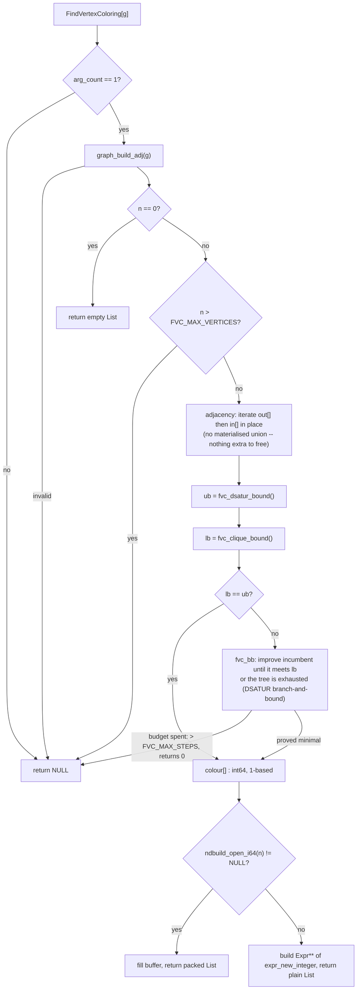

# `FindVertexColoring[g]` Implementation Plan

## TL;DR

Add `FindVertexColoring[g]`, returning **minimal** integer colours in `VertexList` order.
DSATUR seeds an exact backtracking search, so results are genuinely minimal rather than
merely valid. Refuses above 128 vertices via a named cap, and above an 8M-node
budget; `TimeConstrained` is how a caller bounds the wait. Returns a packed int64 `List` via `ndbuild_open_i64`, with a mandatory
plain-`List` fallback. One new file, four phases, no existing head changes.

## Overview

`src/graph/` has 27 heads covering representation, traversal and connectivity, and no
combinatorial-search head at all — every classic algorithm of that family is absent. This
adds the first one.

Wolfram's `FindVertexColoring[g]` returns a minimal colouring: the number of distinct
colours equals the chromatic number. That word *minimal* is the whole difficulty, because
computing it is NP-hard. A greedy or DSATUR-only implementation would return a valid
colouring that is frequently not minimal, which does not fail loudly — it returns a
plausible list of integers that quietly contradicts the documented semantics. So the search
is exact: DSATUR produces an upper bound, then backtracking proves minimality against it.
This matches Wolfram's own `"BacktrackingDS"` method, so shipping only it is a documented
subset rather than a divergence.

Exactness needs a way to give up. The head refuses outright above a named vertex cap.

**Correction, 2026-08-31 (Phase 1).** This said "there is no timeout, no iteration budget,
no abort" — false, and it was the cap's sole justification. `TimeConstrained`
(`src/core.c:4038`) interrupts pure-C builtins via `SIGPROF`, verified empirically, and
`tc_check_deadline()` is exported (`src/core.h:88`) for builtins to poll. The cap was also
*insufficient*, which matters more — see `FVC_MAX_STEPS` in Decisions.

The result is a dense vector of machine integers, so per RG-2's research it owes a packed
producer path. That turns out to be cheap: `AWARE` registration governs consumed arguments
only, so none is needed here.

## Decisions

- **Exact, not DSATUR-only** — a non-minimal result silently contradicts the documented
  semantics; a refusal does not. DSATUR seeds the upper bound, it is not the answer.
- **A greedy-clique lower bound**, so `lb == ub` answers `CompleteGraph[128]` at zero nodes.
- **`FVC_MAX_VERTICES = 128`, refusing above it** (human) — bounds size only. Precedent:
  `FM_MAX_CON` (`src/solve/reduce_fm.c:18`).
- **`TimeConstrained` is the abort channel**; the search polls `tc_check_deadline()`.
- **A node budget, `FVC_MAX_STEPS = 8_000_000`, as a BACKSTOP only** (human, 2026-08-31) —
  guards the unattended case, not responsiveness. At 2M a dense n=100 graph *refused* after
  14 s where it now ANSWERS in 29 s; 8M is ≈101 s at the ceiling (measured).
- **DSATUR branch-and-bound, not iterative deepening over `k`** — dynamic max-saturation
  selection cut n=80 dense from >60 s to 0.33 s.
- **Form 1 only** (human); forms 2–3 are a later mapping layer.
- **No `Method` option** (human) — one algorithm that *is* a named Wolfram method.
- **Phase 1 registers nothing** (human), so no build answers non-minimally.
- **Packed `List`, never visible `NDArray[...]`** (`src/list/range.c:143-149`).
- **Guard rows live in a separate `EXCLUDE_FROM_ALL` target** (human), not as prose:
  unreproducible numbers are what plan review exists to catch.

## Non-goals

- **`FindVertexColoring[g, {c1, ...}]` and `FindVertexColoring[g, l]`.** A later mapping
  layer over form 1: compute the integer index vector once, then substitute the caller's
  objects. Those objects are arbitrary expressions and cannot pack, which is exactly why
  keeping them out keeps the packed obligation on a single branch.
- **`Method -> "ILP"`** — no integer-programming solver exists in-tree.
- **`Method -> "HybridEA"`** — an evolutionary metaheuristic, a separate body of work.
- **`PerformanceGoal`.**
- **Building a general timeout/abort facility.** Not needed: `TimeConstrained` already is
  one and already works on pure-C builtins (see the Overview correction). This head merely
  *cooperates* with it. Auditing the rest of the tree for heads that should poll
  `tc_check_deadline()` and do not is real work, but it is a separate ticket.
- **Fixing the eight backwards-reading "frees res" header comments** (RG-2 research § 3).
- **`ChromaticNumber`**, though `Max` of this result is exactly that.

## Acceptance Criteria

Note on AC-19/AC-20: packedness is **not observable from the language** — a packed list is
a `List` by every language-level measure and no `PackedArrayQ` exists
(`tests/test_utils.h:60-67`). Those two rows are therefore C-level assertions on
`is_packed_list()`, not `assert_eval_eq` rows. Every other row is an expression.

| ID | Given | When | Then | Input | Expected |
|---|---|---|---|---|---|
| AC-1 | a complete graph | coloured | needs exactly n colours | `Max[FindVertexColoring[CompleteGraph[5]]]` | `5` |
| AC-2 | an even cycle | coloured | is 2-colourable | `Max[FindVertexColoring[CycleGraph[6]]]` | `2` |
| AC-3 | an odd cycle | coloured | needs 3 | `Max[FindVertexColoring[CycleGraph[5]]]` | `3` |
| AC-4 | a path | coloured | needs 2 | `Max[FindVertexColoring[PathGraph[4]]]` | `2` |
| AC-5 | an edgeless graph | coloured | every vertex colour 1 | `Union[FindVertexColoring[Graph[{1,2,3,4},{}]]]` | `{1}` |
| AC-6 | any graph | coloured | one colour per vertex | `Length[FindVertexColoring[CycleGraph[7]]]` | `7` |
| AC-7 | an **integer-labelled** graph, vertices `1..n` in order | coloured | no edge joins equal colours | `Module[{g=CycleGraph[5],c},c=FindVertexColoring[g];And@@(c[[#[[1]]]]=!=c[[#[[2]]]]&/@(List@@@EdgeList[g]))]` | `True` |
| AC-8 | a graph with non-integer vertices, path `c–a–b` | coloured | result is in `VertexList` order — **fails under any other order** | `Module[{g=Graph[{c,a,b},{c<->a,a<->b}],col},col=FindVertexColoring[g];{Length[col],col[[1]]===col[[3]]&&col[[1]]=!=col[[2]]}]` | `{3, True}` |
| AC-9 | above the cap | n = 129 | unevaluated, no crash | `Head[FindVertexColoring[CompleteGraph[129]]]` | `FindVertexColoring` |
| AC-10 | exactly at the cap, trivially colourable | n = 128 even cycle | evaluates. **Note: DSATUR returns ub=2 here, so this exercises almost no search — it tests the cap boundary only, not search cost** | `Length[FindVertexColoring[CycleGraph[128]]]` | `128` |
| AC-10b | exactly at the cap, genuinely searched | n = 128 dense | **REFUSES, bounded.** Reworded 2026-08-31: the original "completes < 5 s" is unachievable (unbudgeted: did not finish in 60 s), so the guarantee is that it always terminates — answering or refusing, never guessing | `Head[FindVertexColoring[RandomGraph[{128, 2000}]]]` under `SeedRandom[1]` | `FindVertexColoring` (budget exceeded → unevaluated). **Measured: 8,000,001 nodes, 101.0 s.** Slow target |
| AC-10d | the node budget | a graph needing > FVC_MAX_STEPS nodes | never returns a valid-but-unproven colouring | C: `fvc_search` returns `0` for `RandomGraph[{128, 2000}]` | `true` — **8,000,001 nodes, 101.0 s.** `test_graph_slow.c:test_budget_refuses_rather_than_guessing`. **Excluded from the default suite** (`EXCLUDE_FROM_ALL`, no `add_test`): it must spend the whole budget to prove anything, which outlasts `test_utils.h`'s 60 s `alarm()`. Run `make graph_slow_tests && ./graph_slow_tests`. Cost of the exclusion, stated plainly: CI does not catch a regression here |
| AC-10e | a caller-imposed wait bound | `TimeConstrained` around a slow instance | aborts and the session survives | `TimeConstrained[FindVertexColoring[RandomGraph[{128, 2000}]], 2]` | `$Aborted`. **Phase 2** — needs the head registered; deliberately NOT stubbed in Phase 1, since a row asserting anything about an unregistered head passes for the wrong reason (the AC-14 defect) |
| AC-10c | the worst case under the cap | `CompleteGraph[128]` | answers 128 with **zero search nodes**, because the clique lower bound equals the DSATUR upper bound | C: `fvc_search` returns `128` and writes `steps == 0`. Home: `tests/test_graph.c:test_vertex_coloring_internals` (default suite) | `128`, `steps == 0`. Asserted on the node counter, not on elapsed time — `assert_eval_eq` cannot assert duration, so the earlier "well under a second" was uncheckable |
| AC-10f | a solvable dense instance | n = 100 dense | the budget must NOT convert a correct answer into a refusal — the regression that sized 8M | C: `fvc_search` on `RandomGraph[{100, 1200}]` returns `> 0` with `steps < 8M`. **Property, not value**: `chi == 8` was this RNG on this host and has no external ground truth, so pinning it would fail on any `SeedRandom`/`RandomGraph` change with no colouring bug present | answered, inside budget. Observed 2026-08-31: chi=8, 3,872,135 nodes, 29.2 s (at 2M this refused after 14 s). Slow target |
| AC-11 | a single vertex | coloured | one colour | `FindVertexColoring[Graph[{1},{}]]` | `{1}` |
| AC-12 | the empty graph | coloured | the empty list | `FindVertexColoring[Graph[{},{}]]` | `{}` |
| AC-13 | a non-graph argument | called on `5` | unevaluated | `Head[FindVertexColoring[5]]` | `FindVertexColoring` |
| AC-14 | a malformed graph that actually reaches the head | endpoint absent from the vertex list | unevaluated | `Head[FindVertexColoring[Graph[{1,2},{1<->3}]]]` | `FindVertexColoring` |
| AC-15 | a directed graph | direction ignored for adjacency | needs 2 | `Max[FindVertexColoring[Graph[{1,2},{1->2}]]]` | `2` |
| AC-16 | a disconnected graph | two components | minimal over the whole graph | `Max[FindVertexColoring[Graph[{1,2,3,4},{1<->2,3<->4}]]]` | `2` |
| AC-17 | form 3 (a Non-goal) | called with a count | unevaluated, not silently ignored | `Head[FindVertexColoring[CycleGraph[4], 3]]` | `FindVertexColoring` |
| AC-18 | a bipartite graph | coloured | 2, proving minimality beats greedy | `Max[FindVertexColoring[Graph[{1,2,3,4},{1<->3,1<->4,2<->3,2<->4}]]]` | `2` |
| AC-19 | n >= PACK_MIN_ELEMENTS | 8 vertices | result is a packed buffer | C: `is_packed_list(r)` for `FindVertexColoring[CycleGraph[8]]` | `true` |
| AC-20 | n < PACK_MIN_ELEMENTS | 3 vertices | plain-List fallback, still correct | C: `!is_packed_list(r)` and value `{1,2,3}` for `CycleGraph[3]` | `true` |
| AC-21 | packing disabled | `MATHILDA_NO_PACK=1` | identical values | `Max[FindVertexColoring[CycleGraph[5]]]` under that env | `3` |

## Entry Points

- `FindVertexColoring[g]`

## Open Questions

### Unresolved

_None._

### Resolved

- [x] Which call forms are in scope? — Form 1 only; forms 2 and 3 to Non-goals as a later
  mapping layer, keeping the packed obligation on one branch. _(stated by the human)_
- [x] Which `Method` values? — None; ship exact backtracking seeded by DSATUR, which *is*
  Wolfram's `"BacktrackingDS"`, so it is a documented subset. ILP and HybridEA to
  Non-goals with the reason. _(stated by the human)_
- [x] How to handle NP-hardness without a timeout channel? — A hard vertex cap returning
  unevaluated above it, as a named constant carrying its reasoning. _(stated by the human)_
- [x] What cap value? — 128, justified on typical rather than worst case. _(picked "128"
  over 64, 256, and a density-based gate)_
- [x] Does Phase 1 register a non-minimal head? — No. Build and unit-test the C functions
  unregistered; register in Phase 2 once the search is exact. _(picked "Split, but gate
  Phase 1 behind no registration")_
- [x] Does producing a packed value need a `src/pack.c` `AWARE` entry? — No. `AWARE` is a
  claim about *consuming* a packed argument, feeding the evaluator's transparency gate
  (`src/pack.c:460-488`, `src/eval.c:1509-1523`). There is no producer-side registry, and
  this head consumes a `Graph`. _(resolved by reading the source)_

## Plan Review

Reviewed 2026-08-31 by `plan-reviewer`, testability + coverage-gap lenses. Three BLOCKING
and four WORTH FLAGGING findings, all verified before acceptance. It independently confirmed
every chromatic-number value in the AC table, that `Module`/`=!=`/`@@@`/`Part` all exist and
that AC-7 and AC-8 evaluate against a stubbed colouring in a built binary, and that
`ndbuild_open_i64`'s contract and the no-`AWARE` conclusion are as stated.

### Blocking

_None._

### Worth Flagging

**[WORTH FLAGGING] The Phase 3 cleanup omitted the undirected-neighbour structure and elided the fallback arm**
- Where: Phase 3 code block, against the Core Flow Diagram's `out ∪ in` node
- Why: `graph_adj_free` (`src/graph/graph_util.c:198-204`) frees only `out`/`in`/`outdeg`/
  `indeg`, not a derived union — so a materialised union leaked. Eliding the fallback arm
  behind a comment also duplicated the cleanup across two paths with one invisible, the
  standard shape for a leak on one arm and a double free on the other.
- Addressed: the design no longer materialises a union at all — the search walks `out[]`
  then `in[]` in place, so there is nothing extra to free. Both arms are now shown in full
  with the cleanup written once, and `free(elems)` is called out against
  `expr_new_function`'s memcpy (`src/expr.c:257`), the leak RG-1 measured in all four
  generators.

**[WORTH FLAGGING] `make check-packed-aware` was listed as a pass criterion in three phases and is vacuous for this head**
- Where: Phase 1, 2 and 3 Automated Verification
- Why: `tools/check_packed_aware.py:246-255`'s `DISPATCH_MARKERS` do not include
  `ndbuild_open_i64`, so a pure producer is never nominated and the audit passes without
  considering the head. Listing it read as positive confirmation of the packed path when it
  confirms nothing — the same "silence means never looked" error RG-2's research found.
- Addressed: Phase 3 now labels these three audits must-not-regress checks explicitly and
  names AC-19/AC-20 and `MATHILDA_PACK_DIAG=gate` as the criteria that actually test the
  packed path.

**[WORTH FLAGGING] AC-7's "any graph" claim held only for graphs labelled `1..n` in order**
- Where: AC-7 Given/Then
- Why: the expression indexes the colour vector by vertex *label* (`c[[#[[1]]]]`), not by
  `VertexList` position. It works for `CycleGraph[5]` only because those coincide; applied
  to AC-8's `Graph[{c,a,b},...]` it would raise a `Part` error, so the Given overclaimed.
- Addressed: the Given now reads "an integer-labelled graph, vertices `1..n` in order".

**[WORTH FLAGGING] AC-14 exercised nothing in the new head**
- Where: AC-14
- Why: `Graph[{1},{1->1}]` is already unevaluated — `builtin_graph` returns `NULL` on a
  self-loop — so `Head[FindVertexColoring[...]]` was `FindVertexColoring` regardless of
  whether the head existed. The row passed before a line was written.
- Addressed: replaced with `Graph[{1,2},{1<->3}]` — an endpoint absent from the vertex
  list, which builds and therefore actually reaches the head.

### Resolved (second pass — the Phase 1 amendments, reviewed 2026-08-31)

The amendments made during Phase 1 were re-reviewed by `plan-reviewer` (scope-boundary +
testability). Eight findings, four BLOCKING; all verified against the code and resolved
before Phase 2. Summarised, since each is now reflected in the section it named:

1. **[BLOCKING] `## Performance Considerations` still quoted the rejected 2M budget** (the
   value Decisions records as a regression). → 8M / ≈101 s measured.
2. **[BLOCKING] Three sections still asserted the corrected-away "no abort channel" premise**
   — TL;DR, the `A time-based abort` alternative, and the Phase 1 code block, which had also
   drifted from `vertexcoloring.c` on disk and omitted `FVC_MAX_STEPS`. → all three rewritten;
   the code block now quotes what is actually on disk.
3. **[BLOCKING] A ticked manual-verification box claimed `RandomGraph[{128, 200}]` searched
   zero nodes, which the test cited as pinning it did not assert** (and whose comment claimed
   the opposite). The measurement was real; the assertion was missing. →
   `ASSERT_MSG(steps == 0, ...)` added and the comment corrected; re-run passes.
4. **[BLOCKING] The `TimeConstrained` abort path leaks the search's scratch buffers, while
   the leak box claimed all paths free and Risks said "None."** The `siglongjmp` is a fifth
   exit the hand-trace missed, and it is the exit this plan *recommends*. → stated in both
   places with its bound and its precedent; `## Risks and Rollback` is no longer empty.
5. **[FLAG] AC-10f pinned `chi == 8`, which has no external ground truth** — RNG-dependent.
   → property-based (`answered`, `inside budget`), value kept as a printed diagnostic. AC-10b's
   residual RNG dependence is documented in the test rather than hidden.
6. **[FLAG] AC-10c asserted "well under a second", which `assert_eval_eq` cannot check**, and
   no target owned the row. → restated on the node counter, home test named.
7. **[FLAG] `## Desired End State` and the components table carried stale counts** (21 ACs / 2
   C-level) and promised a `test_vertex_coloring` while `test_vertex_coloring_internals`
   already existed unmentioned. → recounted to 26; the delivered test is named so Phase 2 does
   not add a duplicate.
8. **[FLAG] The Core Flow Diagram had no budget-refusal edge** and still described iterative
   deepening. → refusal edge added, node relabelled to the branch-and-bound semantics.

**[BLOCKING] AC-8 did not discriminate the property it existed to test — it passed identically under sorted vertex order**
- Where: AC-8, and `## Testing Strategy`, which named it as the guard for the
  `VertexList`-order contract
- Why: the graph is the path `c–a–b`. In `{c,a,b}` order a minimal colouring is `{1,2,1}`;
  in sorted `{a,b,c}` order `a` is the degree-2 middle vertex, giving `{1,2,2}`. The
  assertion `col[[1]] =!= col[[2]]` is `True` under both — the reviewer confirmed
  empirically in a built binary. A result indexed by internal adjacency position rather
  than `VertexList` order would have passed the one row meant to catch it.
- Resolved 2026-08-31: assertion strengthened to
  `col[[1]] === col[[3]] && col[[1]] =!= col[[2]]`, which is `True` for `{c,a,b}` and
  `False` for `{a,b,c}`. `## Testing Strategy` now records why the weaker form is
  insufficient, so it is not reintroduced.

**[BLOCKING] The search had no lower bound, and the only sub-cap timing witness was a graph the search never explores**
- Where: Core Flow Diagram (`k = 1..ub`), AC-10, Phase 1 Manual Verification,
  `## Performance Considerations`
- Why: two compounding gaps. (a) DSATUR gave an upper bound but nothing gave a lower one,
  so ascending `k = 1..ub` meant `CompleteGraph[128]` — 128 vertices, *under* the cap and
  therefore accepted — had to refute k=1…127 before answering. That is a hang, and
  `## Non-goals` rules out any timeout or abort, so the only escape was killing the
  process. No AC covered it. (b) The sole evidence the cap was safe was AC-10,
  `CycleGraph[128]`; an even cycle gives ub=2, so the search only refutes k=1 — it cannot
  support "sparse graphs at this order solve well under a second".
- Resolved 2026-08-31: added `fvc_clique_bound` as a greedy-clique lower bound, searching
  `lb..ub` with an `lb == ub` short-circuit — which answers `CompleteGraph[128]` with zero
  search steps. Recorded as a Decision, added to the flow diagram, and covered by three new
  rows: AC-10b (a genuinely searched dense 128-vertex instance with a wall-clock budget) and
  AC-10c (the `lb == ub` shortcut, asserting zero search steps rather than merely "fast").
  `## Performance Considerations` now states the residual honestly: a dense graph where
  neither bound is tight can still be slow, and AC-10b pins one instance rather than
  proving a general bound.

**[BLOCKING] Phase 1's "direct C unit tests" were not mechanically achievable**
- Where: Phase 1 Overview, Automated Verification, Components table
- Why: three blockers. The helpers would be `static` per subsystem norm and a `static`
  function is not callable across translation units; the `graph.h` prototype row was
  assigned to Phase 2, so no declaration existed in Phase 1; and `tests/test_graph.c` does
  not `#include "graph.h"` at all (`:9-15`). The criteria were also phrased over language
  inputs (`CompleteGraph[5]`) with no builtin registered to evaluate them.
- Resolved 2026-08-31: Phase 1 now states the three helpers are non-`static` with
  prototypes added to `graph.h` in Phase 1 — which is not registration, since
  `symtab_add_builtin`, the `SYM_*` sites and the docstring all remain in Phase 2, so the
  "Phase 1 registers nothing" decision is intact. Phase 1 also now specifies the scaffolding:
  `#include "graph.h"`, and building inputs via
  `evaluate(parse_expression("CompleteGraph[5]"))` then `graph_build_adj()`, since
  `core_init()` already runs in `main()`. `#include "pack.h"` noted for Phase 3's
  `is_packed_list`.

## Requires Approval

Two items. **The cap is a user-visible refusal**: `FindVertexColoring` on a 129-vertex
graph returns unevaluated where Wolfram answers. That is a deliberate, documented
divergence, not a bug, and it needs sign-off as such. **Phase 1 introduces direct C unit
tests to `tests/test_graph.c`**, which today tests exclusively through `assert_eval_eq`;
an unregistered head cannot be reached through the evaluator, so this is a consequence of
the phase split rather than a free choice.

## Architecture Impact

- New services introduced: none
- APIs changed: none — one new head, no existing signature touched
- Data crossing a service boundary: none
- New external dependency: none
- Deployment topology change: none

Routine tier for the head itself. **But one finding here has consequences past RG-2** and is
recorded as `docs/design/timeconstrained-abort-channel.md` (2026-08-31): `TimeConstrained` already interrupts pure-C builtins, `tc_check_deadline()` is
exported for them to poll, and only four builtins in the tree poll it — three of them the
Gröbner family, which is the precedent this codifies. The unaudited remainder is named there
as an open follow-up, not closed by this ticket.

`.claude/GUIDANCE_ROLES.md` resolves `architecture-guidance` to `docs/design`, which is
where that record lives, under this directory's descriptive-filename convention.

## Subsystems & Dependencies

- Subsystems touched: `graph` (invocation: inline — no subsystem doc exists at
  `thoughts/shared/subsystems/graph.md`)
- Interdependencies surfaced: `graph` ↔ `pack` — a new producer-direction use of
  `ndbuild_open_i64`, the subsystem's first

## Pre-existing test failures (NOT caused by this change)

Recorded here 2026-08-31 with the evidence, because a reviewer who sees three red tests and
no explanation will reasonably assume RG-2 broke them.

A full `ctest` run reports three failures: `qrdecomposition_machine_tests` (SEGFAULT),
`qrdecomposition_mpfr_tests` (SEGFAULT) and `plot3d_tests` (Subprocess aborted).

**Proven pre-existing by re-running them at baseline** — `git stash -u` (which also removes
the new untracked `vertexcoloring.c` / `test_graph_slow.c` and reverts `tests/CMakeLists.txt`),
rebuild, re-run: `qrdecomposition_machine_tests` still exits **139** with the changes stashed.
`plot3d_tests` aborts at baseline too.

The QR crash is **inside the QR test's own `extract_matrix`**, on its 2×2 real case —
`EXC_BAD_ACCESS` at address `0x2`, per `lldb` backtrace, after the 1×1 case passes. Nothing in
that path touches `src/graph/` or the two files RG-2 modifies outside it (`sym_names.{c,h}`,
whose change is a purely additive new interned name).

One methodological note worth carrying, since it nearly hid this: the QR binaries crash
**with no output at all**, and `./qrdecomposition_machine_tests | tail -3` reports exit 0
because `$?` after a pipeline is *tail's* status. They must be run unpiped, or the segfault
reads as a silent pass.

## Risks and Rollback

One, added 2026-08-31 after plan review. **Aborting via `TimeConstrained` leaks the search's
scratch buffers** (a few KB, bounded by the 128-vertex cap): the `siglongjmp` unwinds past
every `free`, and no cleanup registry exists. Pre-existing tree-wide behaviour, not
introduced here — `FactorInteger` does the same — but this plan actively directs users to
that path, so it is a known cost rather than an unknown one. Accepted for RG-2; fixing it
properly means a cleanup registry, which is `docs/design/timeconstrained-abort-channel.md`'s
territory. AC-10e asserts
`$Aborted` and session survival, **not** leak-freedom.

Rollback is a file delete: the head is new and nothing else calls it.

---

## Current State Analysis

From RG-2 research (`thoughts/shared/tickets/RG-2/research.md`):

- **No colouring code exists.** `FindVertexColoring`, `VertexColoring`, `ChromaticNumber`
  and `FindEdgeColoring` are absent tree-wide, as are 21 other classic algorithms.
- **The substrate is ready.** `graph_build_adj` (`src/graph/graph_util.c:206-260`) gives
  int-indexed `out`/`in` adjacency; `GraphVIdx` maps arbitrary vertex expressions to
  indices. Colouring needs the *undirected* neighbourhood, i.e. `out ∪ in`, exactly as
  `graph_count_components` (`:262-292`) walks it.
- **Self-loops and parallel edges cannot occur.** `graph_check`
  (`src/graph/graph_util.c:299-325`) rejects both at construction, so the search needs no
  guard for either — a self-loop would make a graph uncolourable.
- **The canonical skeleton** is `builtin_find_shortest_path`
  (`src/graph/shortestpath.c:49-71`): validate → `graph_build_adj` → run over `calloc`'d
  scratch → build a fresh result → free scratch + `graph_adj_free`.
- **No option, no diagnostic, one attribute.** Zero `Method`/`OptionValue` and zero
  `Message` calls in `src/graph/`; all 27 heads are `ATTR_PROTECTED` only.
- **Registration is seven sites across four files** — the three `SYM_*` sites
  (`src/sym_names.h:917-946`, `src/sym_names.c:859-890`, `src/sym_names.c:1745-1775`) are
  the ones prior plans omit, and a missed `intern_symbol` leaves a `NULL` that
  identity-compares equal to nothing.
- **Packed producers open-and-fill.** `ndbuild_open_i64` (`src/pack.c:387-399`) allocates
  buffer and node together and returns `NULL` when packing is off, on OOM, or when
  `n < PACK_MIN_ELEMENTS` (4) — so the fallback branch is live in ordinary use, not just
  under an env var.
- **Packedness is untestable from the language** (`tests/test_utils.h:60-67`).

## Desired End State

`FindVertexColoring[g]` is registered, documented, and returns a minimal colouring as a
list of integers in `VertexList` order — packed when the vertex count allows it, a plain
`List` when it does not, with identical values either way. Graphs above 128 vertices return
unevaluated, as do graphs whose exact search exceeds the 8M-node backstop. Verified by **26**
acceptance criteria (recounted 2026-08-31): 20 as expression assertions in
`tests/test_graph.c`; 2 as C-level packedness assertions there (AC-19, AC-20); and 4 in the
separate `tests/test_graph_slow.c` target, which is **excluded from the default suite and
from CI** (AC-10b, AC-10d, AC-10f, plus the sparse-at-cap timings). AC-10e lands in Phase 2.

### Key Discoveries:
- `AWARE` is consumer-only — no producer registration needed (`src/pack.c:460-488`)
- `ndbuild_open_i64` returns `NULL` below 4 elements (`src/pack.c:387-399`)
- Adjacency must be `out ∪ in` (`src/graph/graph_util.c:268-288`)
- Named-cap precedent: `FM_MAX_CON` (`src/solve/reduce_fm.c:18`)

## Components & Files Affected

| File | Change |
|---|---|
| `src/graph/vertexcoloring.c` | **New.** `FVC_MAX_VERTICES` with rationale; `fvc_dsatur_bound` (upper); `fvc_clique_bound` (lower); `fvc_search` (exact backtracking over `lb..ub`); `builtin_find_vertex_coloring`. The three helpers are non-`static` |
| `src/graph/graph.h:127-135` | **Phase 1**: prototypes for the three helpers under the Phase 5 banner. **Phase 2**: the `builtin_*` prototype |
| `tests/test_graph.c:9-15` | Add `#include "graph.h"` (Phase 1). **`#include "pack.h"` is NOT needed** — `is_packed_list` is declared in `ndarray.h` (`:107`), which `test_utils.h` already includes for `test_delist` |
| `src/graph/graph.c:167-172` | `symtab_add_builtin` + `attributes \|= ATTR_PROTECTED` + `symtab_set_docstring` |
| `src/sym_names.h:946` | `extern const char* SYM_FindVertexColoring;` |
| `src/sym_names.c:890` | `const char* SYM_FindVertexColoring = NULL;` |
| `src/sym_names.c:1775` | `SYM_FindVertexColoring = intern_symbol("FindVertexColoring");` |
| `tests/test_graph.c` | **Phase 1 delivered `test_vertex_coloring_internals`** (direct C over the three helpers; registered at `:331`) — Phase 2 must EXTEND or sit alongside it, not silently add a second colouring test. Then `test_vertex_coloring` (expression rows, Phase 2) + `test_vertex_coloring_packing` (C-level, Phase 3) |
| `docs/spec/builtins/graphs.md` | New `##` entry, following the `GraphQ` shape at `:48-58` |
| `docs/spec/changelog/2026-08-31.md` | Append a `##` section (file exists; today is the ISO-week Monday) |
| `tests/CMakeLists.txt:916` | **Phase 1, unplanned.** Add `../src/graph/vertexcoloring.c` to `mathilda_common`. The plan asserted no edit was needed here; that list is EXPLICIT, not a glob, so `graph_tests` failed to link until the file was added |
| `tests/CMakeLists.txt:977` | **Phase 1, unplanned.** New `graph_slow_tests` target, `EXCLUDE_FROM_ALL` and no `add_test()` |
| `tests/test_graph_slow.c` | **New, Phase 1.** AC-10b/AC-10d/AC-10f plus the sparse-at-cap timings. Overrides `test_utils.h`'s 60 s `alarm()` |

Note: `src/core.c` needs **no** change — `graph_init()` is already wired at `:944-945`.
The makefile auto-discovers `src/*.c`. `tests/CMakeLists.txt` does **not** — it lists graph
sources explicitly (`:898-916`), so the new TU had to be added there by hand; the original
claim that it needed no edit was wrong and cost a link failure.

## Core Flow Diagram



## Alternatives Considered

### DSATUR only, no exact search
**Rejected because:** it returns valid but frequently non-minimal colourings. The failure is
silent — a plausible integer list that contradicts the documented meaning of the function.
A wrong answer is worse than a refusal.

### A `Method` option with one legal value
**Rejected because:** it would be the subsystem's first option surface, built to express a
choice that does not yet exist. Adding `Method` later, when a second algorithm lands, costs
no more than adding it now.

### A time-based abort instead of a vertex cap
**Partly ADOPTED, partly rejected — rewritten 2026-08-31.** The original rejection ("the
subsystem has no timeout facility") rested on the false premise corrected in `## Overview`:
`TimeConstrained` exists and interrupts pure-C builtins, so it is now the head's abort
channel and the docstring points users at it.

What survives is narrower and still correct: a wall clock must not *determine the answer*,
or a fast host proves minimality where a slow host refuses the same input. Hence the local
backstop is a node COUNT. The two compose — `TimeConstrained` bounds the caller's wait, the
node budget bounds an unattended run — and neither decides the mathematics.

### Returning a visible `NDArray[...]`
**Rejected because:** every producer precedent returns a packed `List`; `NDArray[...]` is
reserved for explicit array constructors (`src/expr.h:272-288`).

## Scope split: RG-2 ships Phases 1–2; Phases 3–4 become RG-5

Decided by the human, 2026-08-31, after accepting Phase 2. **RG-2 as submitted is Phases 1
and 2**: a registered head with an exact minimality guarantee, AC-1 – AC-18 green, a
documented cap, and a working `TimeConstrained` abort channel. That is a complete, reviewable
change on its own.

Phase 3 (the packed producer path) is an optimisation of the RETURN VALUE and Phase 4 is
documentation. Neither is needed for a reviewer to assess what was built, and holding the
change for them costs a reviewer two hours of latency for no reviewability gain. They move to
**RG-5**, filed AFTER submit so nothing about the follow-up competes with the review of this
one.

Consequences to keep straight when reading the phase sections below:
- Phase 3's and Phase 4's Success Criteria stay UNTICKED here and are not RG-2's
  responsibility. Their content is the starting point for RG-5, not an omission from RG-2.
- The head currently returns a **plain `List`**, always. Every value is pinned by Phase 2's
  tests, which is exactly what makes the Phase 3 swap safe to do later: a divergence shows up
  as a failing AC row.
- AC-19, AC-20 and AC-21 (the packedness rows) are consequently **not satisfied by RG-2** and
  carry over to RG-5.

## Implementation Approach

Four phases, ordered so nothing user-visible is ever wrong. **RG-2 ships the first two** — see
the scope split above. Phase 1 builds the algorithm as
plain C functions with direct unit tests and **no registration** — the head does not exist
at the language level yet, so it cannot answer non-minimally. Phase 2 registers it once the
search is proven exact, which is also when the expression-level acceptance rows become
runnable. Phase 3 adds the packed producer path, which is a return-value change with the
values already pinned by Phase 2's tests — so any divergence shows up immediately. Phase 4
is documentation.

Adjacency comes from `graph_build_adj` and must be the *undirected* neighbourhood
(`out ∪ in`), matching `graph_count_components`. Ownership follows the subsystem norm:
copy out of the borrowed `a->verts`, never transplant, and never `expr_free(res)`.

---

## Phase 1: The algorithm, unregistered

### Overview
Create `src/graph/vertexcoloring.c` with the cap constant, the DSATUR upper bound, the
clique lower bound, and the exact search. **No builtin registration, no `SYM_*` entry, no
docstring** — the head stays invisible at the language level, so no build can answer
non-minimally. Tested by calling the C functions directly.

### Changes Required:

#### 1. New translation unit
**File**: `src/graph/vertexcoloring.c`
**Changes**: cap constant with rationale; `fvc_dsatur_bound`; `fvc_clique_bound`;
`fvc_search`. Header comment follows `src/graph/graph.h:21`'s wording ("the evaluator frees
res"), **not** the eight files that say a bare "frees res" — see RG-2 research § 3.

**The three helpers must be non-`static`, with prototypes added to `src/graph/graph.h` in
THIS phase.** The subsystem norm is `static` for file-local helpers, and a `static`
function is not callable from another translation unit under any linkage — so leaving them
`static` makes this phase's tests impossible to write. Adding the prototypes is not
registration: `symtab_add_builtin`, the `SYM_*` sites and the docstring all stay in Phase
2, so the human's "Phase 1 registers nothing" decision holds exactly.

**Both constants, as they stand on disk after the Phase 1 amendments** (this block was
stale and asserted the corrected-away "no abort channel" premise; replaced 2026-08-31 with
the real comment, abridged):

```c
/* An exact chromatic-number search is NP-hard, so refuse outright above a fixed
 * size rather than build an unbounded amount of scratch state. [...]
 * This is a guard on SIZE only. It is not what keeps the head responsive --
 * TimeConstrained is (see FVC_MAX_STEPS below), and FVC_MAX_STEPS is only the
 * backstop for when nobody is there to interrupt. */
#define FVC_MAX_VERTICES 128

/* [...] THE BUDGET IS A BACKSTOP, NOT THE RESPONSIVENESS MECHANISM.
 * TimeConstrained is [...]. Sized to bound the WORST case rather than to keep
 * the typical one snappy, because a budget tight enough to feel fast converts
 * correct answers into refusals: at 2M nodes a dense n=100 graph refused after
 * 14s where the unbudgeted search had ANSWERED it in 30s. [...]
 * So 8M nodes is ~1.5-2 minutes at the ceiling. */
#define FVC_MAX_STEPS 8000000L
```

### Success Criteria:

#### Automated Verification:
- [x] Build succeeds: `SDKROOT=$(xcrun --show-sdk-path) make -j8`
- [x] Portability gate passes: `make check-c99`
- [x] Packed-array opt-in audit passes: `make check-packed-aware`
- [x] Graph tests pass: `cd tests/build && cmake .. && make graph_tests && ./graph_tests`
- [x] No new `-Wall -Wextra` diagnostics on a clean rebuild of the new TU
- [x] Direct C unit tests cover: `CompleteGraph[5]` is 5, `CycleGraph[6]` is 2,
      `CycleGraph[5]` is 3, bipartite K_{2,2} is 2 (the case DSATUR alone can miss)
- [x] `CompleteGraph[128]` returns 128 with `lb == ub`, taking no search steps — assert the
      search-step counter is zero, not merely that it is fast

**Test scaffolding this phase requires** (none of it exists today, and without it the
criteria above cannot be written):
- `tests/test_graph.c` gains `#include "graph.h"` — it currently includes only
  `expr/eval/core/symtab/parse/print/test_utils` (`:9-15`) and has no route to any
  `src/graph/` internal.
- Because no builtin exists yet, each test must build its input the long way:
  `evaluate(parse_expression("CompleteGraph[5]"))`, then `graph_build_adj()` on the result,
  then call the helper. `core_init()` is already called in `main()`, so the generators are
  available even though `FindVertexColoring` is not.

#### Manual Verification:
- [x] `FindVertexColoring` is **not** reachable from the REPL — confirmed independently by
      the human, 2026-08-31: parses as an undefined symbol, returns unevaluated
- [x] The exact search terminates on a sparse 128-vertex graph **in 0.00 s** — measured,
      2026-08-31, both sparse shapes at the cap: `CycleGraph[128]` → chi=2 and
      `RandomGraph[{128, 200}]` → chi=3, each at **zero search nodes** (both meet their
      bounds, so DSATUR's colouring is proven optimal without searching). Numbers, not
      "promptly", per the human's Phase 1 acceptance. Pinned in `tests/test_graph_slow.c`
      as `test_sparse_at_the_cap_is_fast`.
- [ ] **NO LEAK VERDICT EXISTS.** Deliberately unticked. **Criterion rewritten 2026-08-31
      (Phase 2) to name tools that exist on this host**, because the original one named
      `valgrind` and the honest status of "install valgrind" is not a fix but a WAIT:
      valgrind has no Apple Silicon support at all, so on this machine the criterion was
      unrunnable rather than merely unrun. A leak VERDICT therefore requires Linux and is
      deferred to CI. What replaces it here, both actually run:
      - **macOS `leaks`** for the leak question: `MallocStackLogging=1 leaks -atExit --
        ./graph_tests` reports 760 leaks / 198,368 bytes, and **not one frame is in
        `builtin_find_vertex_coloring`, `graph_build_adj` or any `fvc_*`** — the whole total
        attributes to `evaluate` (396), `assert_eval_eq` (69), `coloured_chi` (12) and
        `parse_expression` (8), i.e. the per-frame harness leak every test in the tree
        shares. The count rose from Phase 1's 737 only because Phase 2's test adds ~20 more
        `assert_eval_eq` rows, each carrying that same pre-existing leak. This is weaker
        than valgrind: `leaks` sees only what is still reachable at exit, so it cannot see a
        transient leak inside a call that later exits cleanly.
      - **`-fsanitize=address`** for use-after-free and buffer overflow, which is a
        DIFFERENT and for this code arguably more valuable question than leaks: `fvc_bb`
        indexes two stack buffers (`seen`, `forbid`) sized by `FVC_MAX_VERTICES + 2`, and a
        bound computed one too large is exactly the defect a hand-trace does not catch.
        Built clean (gcc-16, `SDKROOT` exported, `-fsanitize=address -O1 -g`; the suite's
        CMake refuses clang) and **`./graph_tests` passes all 17 tests with no ASan report**.
        Wiring note for whoever runs this next: it needs a scratch build dir and
        `detect_leaks=0`, since LeakSanitizer is unavailable on Darwin/ARM.

      The hand-trace still stands as far as it goes — every allocation path traced (only
      `int` arrays in Phase 1, plus Phase 2's `elems` array with `free(elems)` against
      `expr_new_function`'s memcpy), freed on all early-return paths.
      **That hand-trace MISSED A FIFTH EXIT** (plan review, 2026-08-31): the
      `tc_check_deadline()` poll in `fvc_bb` can `siglongjmp` out of the recursion, freeing
      nothing — `work`/`best` in `fvc_search`, plus `nbcol`/`order`/`clique` if the jump lands
      inside a bound routine. Bounded (O(n) ints, n ≤ 128; a few KB per abort) and it is the
      tree's standing behaviour rather than anything new — no cleanup registry exists and
      `FactorInteger` aborts identically. But it is the exit this plan now *recommends*, so
      it belongs here and in `## Risks and Rollback`, not only in a source comment. Note
      neither substitute above covers this exit either: `leaks` runs at exit and the abort
      path is not on the default suite's route, so it remains reasoned-about rather than
      measured.

      **This box stays unchecked until valgrind runs on Linux CI.** An unchecked box with a
      named blocker and a named substitute beats a ticked box resting on a hand-trace —
      which is precisely what the `siglongjmp` finding above proved, since the trace was
      confident and wrong. It is an exclusion `/verify-implementation` must reconcile
      against its verdict rather than inherit.

**Implementation Note**: pause for manual confirmation before Phase 2.

---

## Phase 2: Registration

### Overview
Make the head visible: seven registration sites, docstring, and the expression-level
acceptance rows.

### Changes Required:

#### 1. The three `SYM_*` sites
**File**: `src/sym_names.h`, `src/sym_names.c`
**Changes**: declaration, `= NULL` definition, and the `intern_symbol` call. All three —
omitting the third leaves a `NULL` that identity-compares equal to nothing.

#### 2. Prototype and registration
**File**: `src/graph/graph.h`, `src/graph/graph.c`
**Changes**: prototype under the Phase 5 banner; the three-line registration idiom with
`attributes |= ATTR_PROTECTED` (never `symtab_set_attributes`).

**The docstring must name `TimeConstrained` as the way to bound the call** (human,
2026-08-31), with `FVC_MAX_STEPS` described as a last-resort ceiling rather than the
mechanism. A user who hits a slow instance should reach for `TimeConstrained`, not conclude
the head is broken or that the 128 cap is the only lever. It must also state the minimality
guarantee and that exceeding either guard returns *unevaluated*, never a valid-but-larger
colouring.

**State the ceiling as a NUMBER — "8 million search nodes, on the order of 100 seconds" —
not as "bounded"** (human, 2026-08-31). "Bounded" is exactly what the previous version of
this claim said while the real behaviour was an unbounded hang, so the word has already
failed once here. A reader deciding whether to wait or to wrap the call needs the magnitude,
and a number is also falsifiable in a way an adjective is not: if the ceiling moves, a
docstring quoting 8M/100 s is visibly stale, whereas one saying "bounded" silently is not.

#### 3. Tests
**File**: `tests/test_graph.c`
**Changes**: `test_vertex_coloring` with AC-1 through AC-18 as `assert_eval_eq` rows;
register it alongside the existing seven.

### Success Criteria:

#### Automated Verification:
- [x] Build, `make check-c99`, `make check-packed-aware` all pass — no new `-Wall -Wextra`
      diagnostics on a forced rebuild of `vertexcoloring.c` and `graph.c`. `check-packed-aware`
      passes but is **vacuous for this head** (see Phase 3's note): it nominates nothing,
      because `ndbuild_open_i64` is not a `DISPATCH_MARKER` and Phase 2 returns a plain `List`
      anyway
- [x] `./graph_tests` passes, including the new test — 17 tests, all green
- [x] AC-1 – AC-18 all pass as written in the table above — as `assert_eval_eq` rows in
      `test_vertex_coloring`, which sits ALONGSIDE Phase 1's `test_vertex_coloring_internals`
      rather than replacing it: the internals test asserts the node counter (AC-10c), which
      has no language-level observable
- [x] `Options[FindVertexColoring]` returns `{}` — no options are registered, deliberately

#### Manual Verification:
- [x] `?FindVertexColoring` shows the docstring, and it names the minimality guarantee, the
      128-vertex cap, the node budget, and `TimeConstrained` as the way to bound a call —
      verified 2026-08-31 via `Information[FindVertexColoring]`. The ceiling is stated as a
      NUMBER ("8 million search nodes, on the order of 100 seconds") per the human's
      instruction, not as "bounded"; it also states that cost is driven by DENSITY rather
      than by vertex count, which is the part a user hitting a slow instance most needs.
      `Attributes` is `{Protected}`
- [x] AC-10e passes: `TimeConstrained[FindVertexColoring[RandomGraph[{128, 2000}]], 2]` is
      `$Aborted` and the session survives — added as
      `test_graph_slow.c:test_timeconstrained_aborts_a_slow_instance`, replacing the
      placeholder comment Phase 1 left in its place. **Measured: `$Aborted` in 2.00 s**, against
      the 101.5 s the same instance takes to exhaust the node budget — so the deadline
      demonstrably fires through a single non-returning builtin call, which is the claim the
      docstring makes. It asserts termination and survival, **not** leak-freedom
- [x] `FindVertexColoring[CompleteGraph[129]]` returns unevaluated, promptly, no crash —
      **0.0023 s** measured (the cap is checked before any search state is built)
- [x] Results are stable across repeated calls (the search is deterministic) — three
      successive `FindVertexColoring[CycleGraph[5]]` calls all gave `{1, 2, 1, 2, 3}`; also
      asserted in-suite as an `===` row

**Implementation Note**: pause for manual confirmation before Phase 3.

---

## Phase 3: The packed producer path

### Overview
Return a packed int64 `List` via `ndbuild_open_i64`, with the plain-`List` fallback for
`n < 4`, packing disabled, or OOM.

### Changes Required:

#### 1. Packed return
**File**: `src/graph/vertexcoloring.c`
**Changes**: open-and-fill, following `src/list/range.c:143-149`.

Both arms shown in full, and the cleanup written once. Duplicating a cleanup sequence
across two return paths is how one arm leaks and the other double-frees.

```c
    /* colour[] and `a` are the only live allocations here: the search walks
     * a->out and a->in in place, so there is no materialised union to free. */
    Expr* out = NULL;

    int64_t* buf = NULL;
    Expr* packed = ndbuild_open_i64((int64_t)n, &buf);
    if (packed) {
        for (size_t i = 0; i < n; i++) buf[i] = (int64_t)colour[i];
        out = packed;
    } else {
        /* ndbuild_open_i64 declines when packing is disabled
         * (MATHILDA_NO_PACK=1), on OOM, or when n < PACK_MIN_ELEMENTS (4) --
         * so this arm is reached in ordinary use, not only under an env var. */
        Expr** elems = calloc(n > 0 ? n : 1, sizeof(Expr*));
        if (!elems) { free(colour); graph_adj_free(a); return NULL; }
        for (size_t i = 0; i < n; i++)
            elems[i] = expr_new_integer((int64_t)colour[i]);
        out = expr_new_function(expr_new_symbol(SYM_List), elems, n);
        free(elems);   /* expr_new_function memcpys -- src/expr.c:257 */
    }

    free(colour);
    graph_adj_free(a);
    return out;
```

Note `free(elems)`: `expr_new_function` **memcpys** the argument array rather than adopting
it (`src/expr.c:257`), so the caller owns it. This is exactly the leak RG-1 measured across
all four graph generators — do not reproduce it here.

No `src/pack.c` change: `AWARE` governs consumed arguments only.

#### 2. Packedness tests
**File**: `tests/test_graph.c`
**Changes**: `test_vertex_coloring_packing` asserting `is_packed_list()` directly (AC-19,
AC-20) — packedness has no language-level observable. No new include needed:
`is_packed_list` comes from `ndarray.h` (`:107`) via `test_utils.h`.

### Success Criteria:

#### Automated Verification:
- [ ] Build, `make check-c99`, `make check-packed-aware` all pass
- [ ] `./graph_tests` passes; AC-19 and AC-20 hold
- [ ] AC-1 – AC-18 still pass **unchanged** — the packed return must not alter any value
- [ ] `MATHILDA_NO_PACK=1 ./graph_tests` passes (AC-21), exercising the fallback
- [ ] `make check-nd-surfaces` and `make check-array-exactness` pass

**These three audits are must-not-regress checks, NOT evidence the packed path works.**
`tools/check_packed_aware.py:246-255`'s `DISPATCH_MARKERS` are `is_ndarray(`,
`EXPR_NDARRAY`, `is_packed_list(`, `linalg_call_has_ndarray` and similar —
`ndbuild_open_i64` is not among them, so a pure *producer* is never nominated and the audit
passes without ever considering this head. Treating a green run here as confirmation would
repeat exactly the error RG-2's research found: audit silence in this subsystem means
"never looked", not "checked and exempt". The criteria that actually test the packed path
are AC-19/AC-20 (C-level `is_packed_list`) and the `MATHILDA_PACK_DIAG=gate` check below.

#### Manual Verification:
- [ ] `FindVertexColoring[CycleGraph[8]]` prints as a normal `{...}` list — packing is
      invisible at the language level
- [ ] `Head[FindVertexColoring[CycleGraph[8]]]` is `List`, never `NDArray`
- [ ] Both the packed and the fallback branch checked for leaks. **Not with valgrind** —
      unavailable on Apple Silicon, see the rewritten Phase 1 leak box for the substitutes
      that do run here (`leaks` for reachable-at-exit, `-fsanitize=address` for
      use-after-free/overflow). A valgrind verdict is deferred to Linux CI. This branch is
      where it matters most: the fallback arm is the one that calls `expr_new_integer` in a
      loop and `free(elems)` against `expr_new_function`'s memcpy
- [ ] `MATHILDA_PACK_DIAG=gate` shows the head causing no gate materialisations

**Implementation Note**: pause for manual confirmation before Phase 4.

---

## Phase 4: Documentation

### Overview
The two required docs surfaces, per `CLAUDE.md`.

### Changes Required:

#### 1. Builtin reference
**File**: `docs/spec/builtins/graphs.md`
**Changes**: a `##` entry in the `GraphQ` shape (`:48-58`) — prose, then an
`Input (* Output *)` block. States minimality, `VertexList` order, the 128 cap, and that
forms 2 and 3 are not implemented.

#### 2. Changelog
**File**: `docs/spec/changelog/2026-08-31.md`
**Changes**: append a `##` section. The file exists; today is the ISO-week Monday.

### Success Criteria:

#### Automated Verification:
- [ ] Every example in the new `graphs.md` block produces its stated output when pasted
      into the REPL
- [ ] Full graph test suite still passes

#### Manual Verification:
- [ ] The docs state the cap and the unimplemented forms plainly — a reader should not
      discover either by hitting an unevaluated result
- [ ] `Mathilda_spec.md` needs no change (no new top-level category)

---

## Testing Strategy

The acceptance table is the test suite; this covers what it does not.

### Edge Cases & Integration Scenarios:
- **Bipartite K_{2,2} (AC-18)** is the discriminating case: greedy or DSATUR on an
  unlucky vertex order returns 3, exact returns 2. If minimality regresses, this fails
  first.
- **Non-integer vertices (AC-8)** guard the `VertexList`-order contract. The assertion must
  be *position-sensitive*: on the path `c–a–b`, order `{c,a,b}` colours `{1,2,1}` and a
  sorted `{a,b,c}` colours `{1,2,2}`, so a mere "first two differ" check passes under both
  and catches nothing. `col[[1]] === col[[3]] && col[[1]] =!= col[[2]]` distinguishes them.
- **The cap boundary** needs five cases, not one: 129 refuses (AC-9), 128 sparse evaluates
  (AC-10), 128 complete hits the `lb == ub` shortcut at zero nodes (AC-10c), 128 *dense*
  exhausts the budget and refuses (AC-10b/AC-10d), and 100 dense **answers** (AC-10f) —
  that last one is what stops the budget being tightened until correct results become
  refusals. AC-10 alone is misleading: an even cycle gives ub=2, so it searches nothing.
- **Sparse at the cap searches NOTHING**, which is worth knowing rather than assuming:
  measured 2026-08-31, both `CycleGraph[128]` (chi=2) and `RandomGraph[{128, 200}]` (chi=3)
  meet `lb == ub` and answer at zero nodes in 0.00 s. The cost curve is driven by density,
  not by n — which is exactly why the vertex cap alone was never a sufficient guard.
- **Three rows live outside the default suite** (`tests/test_graph_slow.c`, target
  `graph_slow_tests`, `EXCLUDE_FROM_ALL` + no `add_test()`). They must actually spend
  FVC_MAX_STEPS to prove anything, so they take ~2.2 minutes together and outlast
  `test_utils.h`'s 60 s `alarm()` (which the file re-arms to 600 s). The honest cost: CI
  does not run them, so a budget-logic regression is caught only when someone runs
  `make graph_slow_tests && ./graph_slow_tests`. The alternative was prose in this plan,
  which is not reproducible at all.
- **Both packed branches** run in ordinary use, since `n < 4` is common in tests.

### Build environment (Darwin):
- **`gcc-16` needs `SDKROOT` exported or nothing compiles.** On this host a bare `make`
  fails at the very first translation unit with
  `src/expr.h:7:10: fatal error: stdio.h: No such file or directory` — Homebrew GCC does
  not find the macOS SDK headers on its own, and the makefile refuses `CC=clang`
  ("must be built with real GCC"), so the error looks like a broken tree rather than a
  broken toolchain path. The fix, for both the main build and the CMake test build:
  ```
  export SDKROOT=/Library/Developer/CommandLineTools/SDKs/MacOSX.sdk
  ```
  Verified 2026-08-31: with it set, `make -j8`, `cmake ..`, `graph_tests` and
  `graph_slow_tests` all build and pass; without it, zero object files are produced.

### Manual Testing Steps:
1. `FindVertexColoring[CycleGraph[5]]` → three colours, no adjacent pair equal.
2. `FindVertexColoring[CompleteGraph[129]]` → unevaluated, promptly.
3. `MATHILDA_NO_PACK=1 ./Mathilda`, repeat step 1 → identical values.
4. Leak/memory check on `./graph_tests`. `valgrind --leak-check=full` is the criterion but
   **runs only on Linux** — no Apple Silicon support — so on a Darwin host use
   `MallocStackLogging=1 leaks -atExit -- ./graph_tests` (expect frames attributable to the
   new TU: none) plus an `-fsanitize=address` build for use-after-free and overflow. See the
   Phase 1 leak box for the exact invocations and what each one cannot see.

## Performance Considerations

Exact chromatic number is exponential in the worst case. The cap bounds *size* by refusal,
not time — but size alone does not bound cost, which is why the clique lower bound matters
more than the cap: it is what collapses `CompleteGraph[128]` (accepted, under the cap) from
127 futile refutations to zero search. The two bounds together are the real guard; the cap
only keeps them in a range where they work.

Honest residual, **rewritten 2026-08-31 after measuring it**: the bounds do not make the
search cheap in general, and the original text here ("can still be slow") understated it by a
lot. At density ≈0.24 the cost is 0.33 s at n=80, 30 s at n=100, and unbounded at n=128 — all
*under* the cap. So the cap was nominal. Cost is now bounded by `FVC_MAX_STEPS` (**8M nodes, ≈101 s
measured** at n=128 dense), on exceeding which the head REFUSES rather than answering
non-minimally, plus `tc_check_deadline()` polling so `TimeConstrained` can impose a tighter
interactive bound — which is the mechanism a user should actually reach for. The budget is
sized to bound the pathological case, not the typical one: at 2M it refused a dense n=100
graph after 14 s that it now answers in 29 s.
The two together mean the head always terminates; they do not make it fast, and a dense
graph near the cap is expected to refuse rather than answer. `graph_build_adj` is rebuilt per call
as everywhere in the subsystem, negligible at n ≤ 128.

## Migration Notes

None. A new head with no existing callers, no changed signature, and no persisted data.

## References

- Research: `thoughts/shared/tickets/RG-2/research.md`
- Research summary: `thoughts/shared/tickets/RG-2/research-summary.md`
- Wolfram reference: `http://reference.wolfram.com/language/ref/FindVertexColoring.html`
- Canonical skeleton: `src/graph/shortestpath.c:49-71`
- Shared adjacency: `src/graph/graph_util.c:206-260`, `:262-292`
- Packed producer precedent: `src/list/range.c:143-149`, `src/random.c:471-496`
- `ndbuild_open_i64`: `src/pack.c:387-399`
- `AWARE` is consumer-only: `src/pack.c:460-488`, `src/eval.c:1509-1523`
- Named-cap precedent: `src/solve/reduce_fm.c:18`, `src/ndinteger.c:219`
- Packedness untestable from the language: `tests/test_utils.h:60-67`
- Prior graph ticket (conformance template): `thoughts/shared/tickets/RG-1/` on branch
  `rg-1-random-graph-count`
